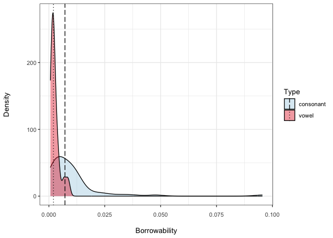

Plots and statistics for the paper: Operationalizing borrowability:
phonological segments as a case study
================
Elad Eisen, Steven Moran
(26 September, 2023)

# Libraries

``` r
 library(plyr)
 library(rstatix) 
 library(tidyverse)
```

# Data

First, load the data.

``` r
df <- read_csv('probablistic_model/model_1_borrowability.csv')
df_w_features <- read_csv('probablistic_model/model_1_borrowability_w_features.csv')
```

# Statistics and plots

## Frequency of borrowing vs. typological frequency

``` r
p <- ggplot(df, aes(x=PHOIBLE_frequency_relative, y=SEGBO_frequency_relative)) +
  xlab("Typological frequency") + ylab("Frequency of borrowing") +
  geom_text(label=df$Segment)+
  geom_smooth(span=0.4, method="loess") +
  theme_bw() +
  theme(axis.text.x = element_text(margin = margin(t = 8))) +
  theme(axis.title.x = element_text(margin = margin(t = 15, r = 0, b = 0, l = 0))) +
  theme(axis.title.y = element_text(margin = margin(t = 0, r = 25, b = 0, l = 0)))
p
```

    ## `geom_smooth()` using formula = 'y ~ x'

<!-- -->

``` r
ggsave(file="figures/freq_scatter_loess.svg", plot=p, width=10, height=6)
```

    ## `geom_smooth()` using formula = 'y ~ x'

``` r
p <- ggplot(df, aes(x=PHOIBLE_frequency_relative, y=SEGBO_frequency_relative)) +
  xlab("Typological frequency") + 
  ylab("Frequency of borrowing") +
  geom_text(label=df$Segment) +
  geom_smooth(span=0.4, method="loess", color="black", linewidth=0.2) +
  theme_bw() +
  theme(axis.text.x = element_text(margin = margin(t = 8))) +
  theme(axis.title.x = element_text(margin = margin(t = 15, r = 0, b = 0, l = 0))) +
  theme(axis.title.y = element_text(margin = margin(t = 0, r = 25, b = 0, l = 0)))
p
```

    ## `geom_smooth()` using formula = 'y ~ x'

<!-- -->

``` r
ggsave(file="figures/freq_scatter_loess_bw.svg", plot=p, width=10, height=6)
```

    ## `geom_smooth()` using formula = 'y ~ x'

## Borrowability of consonants vs. vowels

``` r
my_colors <- RColorBrewer::brewer.pal(6, "Paired")[c(1,6)]
type_median <- ddply(df_w_features, .(Type), numcolwise(median))
p <- ggplot(data=df_w_features, aes(x=Borrowability, group=Type, fill=Type)) +
  scale_fill_manual(values = my_colors) +
  geom_density(adjust=1.5, alpha=.4) +
  geom_vline(data=type_median, aes(xintercept=Borrowability, linetype=Type), linewidth=0.5) +
  ylab("Density") +
  scale_linetype_manual(values=c("longdash", "dotted")) +
  theme_bw() +
  theme(axis.text.x = element_text(margin = margin(t = 8))) +
  theme(axis.title.x = element_text(margin = margin(t = 15, r = 0, b = 0, l = 0))) +
  theme(axis.title.y = element_text(margin = margin(t = 0, r = 25, b = 0, l = 0)))
p
```

<!-- -->

``` r
ggsave(file="figures/consonants_vs_vowels.svg", plot=p, width=10, height=6)
```

``` r
my_colors <- RColorBrewer::brewer.pal(6, "Paired")[c(1,6)]
type_median <- ddply(df_w_features, .(Type), numcolwise(median))

p <- ggplot(data=df_w_features, aes(x=Borrowability, group=Type, fill=Type)) +
  scale_fill_grey(start = 0.8, end = 0.2) +
  geom_density(adjust=1.5, alpha=.4) +
  geom_vline(data=type_median, aes(xintercept=Borrowability, linetype=Type), linewidth=0.5) +
  ylab("Density") +
  scale_linetype_manual(values=c("dotted", "dashed")) +
  theme_bw() +
  theme(axis.text.x = element_text(margin = margin(t = 8))) +
  theme(axis.title.x = element_text(margin = margin(t = 15, r = 0, b = 0, l = 0))) +
  theme(axis.title.y = element_text(margin = margin(t = 0, r = 25, b = 0, l = 0)))
p
```

<!-- -->

``` r
ggsave(file="figures/consonants_vs_vowels_bw.svg", plot=p, width=10, height=6)
```

Wilcoxon rank-sum test for whether consonants or vowels are
statistically more significant when comparing mean scores.

``` r
wilcox.test(Borrowability ~ Type, data = df_w_features, conf.int = T)
```

    ## 
    ##  Wilcoxon rank sum test with continuity correction
    ## 
    ## data:  Borrowability by Type
    ## W = 948, p-value = 6.186e-05
    ## alternative hypothesis: true location shift is not equal to 0
    ## 95 percent confidence interval:
    ##  0.001711905 0.007405177
    ## sample estimates:
    ## difference in location 
    ##            0.004220201

``` r
wilcox_effsize(data=df_w_features, formula=Borrowability ~ Type)
```

    ## # A tibble: 1 × 7
    ##   .y.           group1    group2 effsize    n1    n2 magnitude
    ## * <chr>         <chr>     <chr>    <dbl> <int> <int> <ord>    
    ## 1 Borrowability consonant vowel    0.440    65    18 moderate
