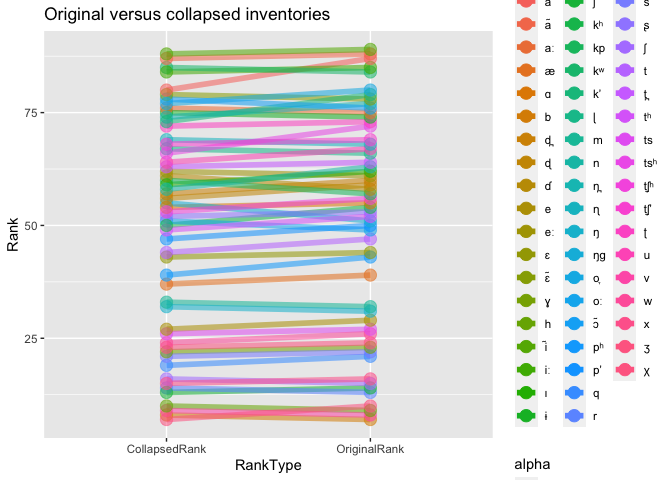

Generate borrowability scores with a probabilistic model of segment
borrowability
================
Steven Moran and Elad Eisen
(22 November, 2021)

-   [Overview](#overview)
    -   [Random sampling](#random-sampling)
    -   [Collapse all inventories](#collapse-all-inventories)
-   [Compare the results](#compare-the-results)
-   [References](#references)

# Overview

This supplementary materials for “Defining and operationalizing
borrowability for language contact research: Phonological segment
borrowing as a case study” uses the R programming language (R Core Team
2021) and the following R libraries (Wickham et al. 2019; Xie 2021).

``` r
library(tidyverse)
library(knitr)
```

Load the data from the [CLDF format](https://cldf.clld.org) (Forkel et
al. 2018) and combine the tables into single dataframes for
[PHOIBLE](https://phoible.org) (Moran and McCloy 2019) and
[SegBo](https://github.com/segbo-db/segbo) (Grossman et al. 2020).

``` r
values <- read_csv('../data/segbo/cldf/values.csv')
languages <- read_csv('../data/segbo/cldf/languages.csv')
segbo <- left_join(values, languages, by=c("Language_ID"="ID"))

values <- read_csv('../data/phoible/cldf/values.csv')
languages <- read_csv('../data/phoible/cldf/languages.csv')
phoible <- left_join(values, languages, by=c("Language_ID"="ID"))
```

A segment’s borrowability factor `bS` is calculated by Eisen (2019, 60):

$$
b\_s = \\frac{P\_s}{f\_s - f\_s^2}
$$

where `Ps` is the probability of borrowing a segment and `fs` is its
typological frequency. Empirical estimations for the probability of
borrowing and the typological frequency are estimated from SegBo and
PHOIBLE, respectively.

Get the typological frequency of segments in phoible.

``` r
num_phoible_inventories <- phoible %>% select(Inventory_ID) %>% distinct() %>% nrow()
phoible_segment_counts <- as.data.frame(table(phoible$Value))
phoible_segment_counts <- phoible_segment_counts %>% rename(Segment = Var1, PhoibleFreq = Freq)
phoible_segment_counts$Segment <- as.character(phoible_segment_counts$Segment)
phoible_segment_counts$PhoibleCrossFreq <- phoible_segment_counts$PhoibleFreq / num_phoible_inventories
```

Get segbo segment frequencies.

``` r
num_segbo_inventories <- segbo %>% select(Inventory_ID) %>% distinct() %>% nrow()
segbo_segment_counts <- as.data.frame(table(segbo$Value))
segbo_segment_counts <- segbo_segment_counts %>% rename(Segment = Var1, SegboFreq = Freq)
segbo_segment_counts$Segment <- as.character(segbo_segment_counts$Segment)
segbo_segment_counts$SegboCrossFreq <- segbo_segment_counts$SegboFreq / num_segbo_inventories
```

Combine segbo and phoible.

``` r
bs_df_new <- left_join(segbo_segment_counts, phoible_segment_counts)
```

    ## Joining, by = "Segment"

Calculate all borrowability scores (can drop low frequency stuff later).

``` r
bs_df_new$BorrowabilityScore <- bs_df_new$SegboCrossFreq / (bs_df_new$PhoibleCrossFreq - bs_df_new$PhoibleCrossFreq ^ 2)
```

Let’s get the top 20 as a table for the publication.

``` r
t <- bs_df_new %>% filter(PhoibleCrossFreq > .05) %>% arrange(desc(BorrowabilityScore)) %>% head(n=20) %>% select(Segment, BorrowabilityScore, PhoibleCrossFreq, SegboCrossFreq)

t <- t %>% rename(Phoneme = Segment, Borrowability = BorrowabilityScore, `Typological Frequency` = PhoibleCrossFreq, `Borrowing Frequency` = SegboCrossFreq)

library(xtable)
# print(xtable(t), include.rownames=FALSE)
```

## Random sampling

The problem, however, is that cross-linguistic frequency is treated as
*all* the data points and not just a unique list of languages. So for
example, segments in either data source (phoible or segbo) are counted
multiple times – consider the four inventories for Akan in phoible.

``` r
phoible %>% filter(Glottocode == "akan1250") %>% group_by(Inventory_ID, Glottocode, ISO639P3code, Name) %>% summarize(SegmentCount = n()) %>% kable()
```

    ## `summarise()` has grouped output by 'Inventory_ID', 'Glottocode', 'ISO639P3code'. You can override using the `.groups` argument.

| Inventory\_ID | Glottocode | ISO639P3code | Name | SegmentCount |
|--------------:|:-----------|:-------------|:-----|-------------:|
|           140 | akan1250   | aka          | Akan |           40 |
|           208 | akan1250   | aka          | Akan |           35 |
|           655 | akan1250   | aka          | Akan |           31 |
|          1245 | akan1250   | aka          | Akan |           60 |

So, segments that are shared across these inventories are counted more
than one for the “same” language.

Let’s try random sampling one inventory per language from phoible and
then calculate the borrowability scores. Later we can compare the
results between various samples.

``` r
phoible %>%
    distinct(Inventory_ID, ISO639P3code) %>%
    group_by(ISO639P3code) %>%
    sample_n(1) %>%
    pull(Inventory_ID) ->
    inventory_ids_sampled_one_per_isocode

phoible %>%
    filter(Inventory_ID %in% inventory_ids_sampled_one_per_isocode) ->
    my_sample

num_phoible_inventories <- my_sample %>% select(Inventory_ID) %>% distinct() %>% nrow()
phoible_segment_counts <- as.data.frame(table(my_sample$Value))
phoible_segment_counts <- phoible_segment_counts %>% rename(Segment = Var1, PhoibleFreq = Freq)
phoible_segment_counts$Segment <- as.character(phoible_segment_counts$Segment)
phoible_segment_counts$PhoibleCrossFreq <- phoible_segment_counts$PhoibleFreq / num_phoible_inventories
```

We’ll use the same segbo counts from above, even though they produce the
same problem, i.e. there are multiple reports (“inventories”) for the
same language.

Combine segbo and random phoible.

``` r
bs_df_random <- left_join(segbo_segment_counts, phoible_segment_counts)
```

    ## Joining, by = "Segment"

Calculate all borrowability scores (can drop low frequency stuff later).

``` r
bs_df_random$BorrowabilityScore <- bs_df_random$SegboCrossFreq / (bs_df_random$PhoibleCrossFreq - bs_df_random$PhoibleCrossFreq ^ 2)
```

Let’s have a look.

``` r
bs_df_random %>% filter(PhoibleCrossFreq > .05) %>% arrange(desc(BorrowabilityScore)) %>% head(n=25) %>% kable()
```

| Segment | SegboFreq | SegboCrossFreq | PhoibleFreq | PhoibleCrossFreq | BorrowabilityScore |
|:--------|----------:|---------------:|------------:|-----------------:|-------------------:|
| f       |       148 |      0.2792453 |         929 |        0.4425917 |          1.1319028 |
| p       |        48 |      0.0905660 |        1801 |        0.8580276 |          0.7434646 |
| d̠ʒ      |        75 |      0.1415094 |         582 |        0.2772749 |          0.7061577 |
| ɡ       |        84 |      0.1584906 |        1204 |        0.5736065 |          0.6480056 |
| t̠ʃ      |        71 |      0.1339623 |         842 |        0.4011434 |          0.5576478 |
| z       |        60 |      0.1132075 |         629 |        0.2996665 |          0.5394265 |
| ʒ       |        34 |      0.0641509 |         296 |        0.1410195 |          0.5295909 |
| b       |        64 |      0.1207547 |        1336 |        0.6364936 |          0.5219128 |
| v       |        54 |      0.1018868 |         590 |        0.2810862 |          0.5041985 |
| h       |        64 |      0.1207547 |        1197 |        0.5702716 |          0.4927519 |
| k       |        19 |      0.0358491 |        1911 |        0.9104335 |          0.4396267 |
| d       |        54 |      0.1018868 |        1011 |        0.4816579 |          0.4080964 |
| j       |        19 |      0.0358491 |        1889 |        0.8999524 |          0.3981543 |
| r       |        52 |      0.0981132 |         960 |        0.4573606 |          0.3953278 |
| x       |        30 |      0.0566038 |         366 |        0.1743687 |          0.3931793 |
| ʃ       |        46 |      0.0867925 |         740 |        0.3525488 |          0.3802381 |
| l       |        42 |      0.0792453 |        1453 |        0.6922344 |          0.3719634 |
| ɸ       |         9 |      0.0169811 |         111 |        0.0528823 |          0.3390410 |
| q       |        12 |      0.0226415 |         162 |        0.0771796 |          0.3178964 |
| ɾ       |        30 |      0.0566038 |         536 |        0.2553597 |          0.2976778 |
| s       |        34 |      0.0641509 |        1439 |        0.6855646 |          0.2975933 |
| ɣ       |        17 |      0.0320755 |         279 |        0.1329204 |          0.2783059 |
| χ       |         9 |      0.0169811 |         138 |        0.0657456 |          0.2764616 |
| w       |        18 |      0.0339623 |        1767 |        0.8418294 |          0.2550627 |
| o       |        31 |      0.0584906 |        1334 |        0.6355407 |          0.2525186 |

## Collapse all inventories

Nikolaev in BSD model 2 simply collapses all of the duplicate
inventories into “single” languages, instead of randomizing or
bootstrapping the samples. Let’s do the same here for phoible and segbo.
Then we can compare the original, randomly sampled, and
all-inventories-as-one language approaches and the resulting
borrowability scores.

``` r
collapsed_inventories <- phoible %>% group_by(ISO639P3code) %>% select(ISO639P3code, Value)

num_phoible_inventories <- collapsed_inventories %>% select(ISO639P3code) %>% distinct() %>% nrow()
phoible_segment_counts <- as.data.frame(table(my_sample$Value))
phoible_segment_counts <- phoible_segment_counts %>% rename(Segment = Var1, PhoibleFreq = Freq)
phoible_segment_counts$Segment <- as.character(phoible_segment_counts$Segment)
phoible_segment_counts$PhoibleCrossFreq <- phoible_segment_counts$PhoibleFreq / num_phoible_inventories
```

And do the same for segbo.

``` r
segbo_collapsed <- segbo %>% group_by(ISO639P3code, Value)
num_segbo_inventories <- segbo %>% select(ISO639P3code) %>% distinct() %>% nrow()
segbo_segment_counts <- as.data.frame(table(segbo$Value))
segbo_segment_counts <- segbo_segment_counts %>% rename(Segment = Var1, SegboFreq = Freq)
segbo_segment_counts$Segment <- as.character(segbo_segment_counts$Segment)
segbo_segment_counts$SegboCrossFreq <- segbo_segment_counts$SegboFreq / num_segbo_inventories
```

Combine them and get the borrowability score.

``` r
bs_df_collapsed <- left_join(segbo_segment_counts, phoible_segment_counts)
```

    ## Joining, by = "Segment"

``` r
bs_df_collapsed$BorrowabilityScore <- bs_df_collapsed$SegboCrossFreq / (bs_df_collapsed$PhoibleCrossFreq - bs_df_collapsed$PhoibleCrossFreq ^ 2)
```

Let’s have a look.

``` r
bs_df_collapsed %>% filter(PhoibleCrossFreq > .05) %>% arrange(desc(BorrowabilityScore)) %>% head(n=25) %>% kable()
```

| Segment | SegboFreq | SegboCrossFreq | PhoibleFreq | PhoibleCrossFreq | BorrowabilityScore |
|:--------|----------:|---------------:|------------:|-----------------:|-------------------:|
| f       |       148 |      0.2995951 |         929 |        0.4425917 |          1.2143897 |
| p       |        48 |      0.0971660 |        1801 |        0.8580276 |          0.7976442 |
| d̠ʒ      |        75 |      0.1518219 |         582 |        0.2772749 |          0.7576186 |
| ɡ       |        84 |      0.1700405 |        1204 |        0.5736065 |          0.6952287 |
| t̠ʃ      |        71 |      0.1437247 |         842 |        0.4011434 |          0.5982861 |
| z       |        60 |      0.1214575 |         629 |        0.2996665 |          0.5787369 |
| ʒ       |        34 |      0.0688259 |         296 |        0.1410195 |          0.5681845 |
| b       |        64 |      0.1295547 |        1336 |        0.6364936 |          0.5599470 |
| v       |        54 |      0.1093117 |         590 |        0.2810862 |          0.5409417 |
| h       |        64 |      0.1295547 |        1197 |        0.5702716 |          0.5286609 |
| k       |        19 |      0.0384615 |        1911 |        0.9104335 |          0.4716643 |
| d       |        54 |      0.1093117 |        1011 |        0.4816579 |          0.4378362 |
| j       |        19 |      0.0384615 |        1889 |        0.8999524 |          0.4271695 |
| r       |        52 |      0.1052632 |         960 |        0.4573606 |          0.4241372 |
| x       |        30 |      0.0607287 |         366 |        0.1743687 |          0.4218320 |
| ʃ       |        46 |      0.0931174 |         740 |        0.3525488 |          0.4079478 |
| l       |        42 |      0.0850202 |        1453 |        0.6922344 |          0.3990700 |
| ɸ       |         9 |      0.0182186 |         111 |        0.0528823 |          0.3637484 |
| q       |        12 |      0.0242915 |         162 |        0.0771796 |          0.3410629 |
| ɾ       |        30 |      0.0607287 |         536 |        0.2553597 |          0.3193710 |
| s       |        34 |      0.0688259 |        1439 |        0.6855646 |          0.3192803 |
| ɣ       |        17 |      0.0344130 |         279 |        0.1329204 |          0.2985872 |
| χ       |         9 |      0.0182186 |         138 |        0.0657456 |          0.2966086 |
| w       |        18 |      0.0364372 |        1767 |        0.8418294 |          0.2736502 |
| o       |        31 |      0.0627530 |        1334 |        0.6355407 |          0.2709208 |

# Compare the results

Compare the frequencies.

``` r
bs_df_new_cut <- bs_df_new %>% select(Segment, PhoibleCrossFreq, BorrowabilityScore)
bs_df_collapsed_cut <- bs_df_collapsed %>% select(Segment, BorrowabilityScore)%>% rename(BorrowabilityScore_collapsed = BorrowabilityScore)
bs_df_random_cut <- bs_df_random %>% select(Segment, BorrowabilityScore) %>% rename(BorrowabilityScore_random = BorrowabilityScore)

results <- left_join(bs_df_new_cut, bs_df_collapsed_cut)
```

    ## Joining, by = "Segment"

``` r
results <- left_join(results, bs_df_random_cut)
```

    ## Joining, by = "Segment"

Have a look.

``` r
results %>% filter(PhoibleCrossFreq > .05) %>% arrange(desc(BorrowabilityScore)) %>% head(n=25) %>% kable()
```

| Segment | PhoibleCrossFreq | BorrowabilityScore | BorrowabilityScore\_collapsed | BorrowabilityScore\_random |
|:--------|-----------------:|-------------------:|------------------------------:|---------------------------:|
| f       |        0.4403974 |          1.1330821 |                     1.2143897 |                  1.1319028 |
| p       |        0.8586093 |          0.7460172 |                     0.7976442 |                  0.7434646 |
| d̠ʒ      |        0.2715232 |          0.7154228 |                     0.7576186 |                  0.7061577 |
| ɡ       |        0.5668874 |          0.6455142 |                     0.6952287 |                  0.6480056 |
| t̠ʃ      |        0.4033113 |          0.5566655 |                     0.5982861 |                  0.5576478 |
| z       |        0.2956954 |          0.5435886 |                     0.5787369 |                  0.5394265 |
| b       |        0.6311258 |          0.5186924 |                     0.5599470 |                  0.5219128 |
| v       |        0.2701987 |          0.5166900 |                     0.5409417 |                  0.5041985 |
| h       |        0.5639073 |          0.4910408 |                     0.5286609 |                  0.4927519 |
| ʒ       |        0.1582781 |          0.4815191 |                     0.5681845 |                  0.5295909 |
| k       |        0.9036424 |          0.4117135 |                     0.4716643 |                  0.4396267 |
| d       |        0.4556291 |          0.4107821 |                     0.4378362 |                  0.4080964 |
| r       |        0.4410596 |          0.3979832 |                     0.4241372 |                  0.3953278 |
| j       |        0.8993377 |          0.3959937 |                     0.4271695 |                  0.3981543 |
| ʃ       |        0.3655629 |          0.3742237 |                     0.4079478 |                  0.3802381 |
| x       |        0.1900662 |          0.3676977 |                     0.4218320 |                  0.3931793 |
| l       |        0.6768212 |          0.3622902 |                     0.3990700 |                  0.3719634 |
| ɸ       |        0.0506623 |          0.3530705 |                     0.3637484 |                  0.3390410 |
| ð       |        0.0529801 |          0.3384500 |                     0.3904295 |                  0.3639098 |
| ɾ       |        0.2562914 |          0.2969673 |                     0.3193710 |                  0.2976778 |
| q       |        0.0847682 |          0.2918376 |                     0.3410629 |                  0.3178964 |
| s       |        0.6692053 |          0.2897912 |                     0.3192803 |                  0.2975933 |
| ɣ       |        0.1443709 |          0.2596617 |                     0.2985872 |                  0.2783059 |
| χ       |        0.0711921 |          0.2568084 |                     0.2966086 |                  0.2764616 |
| o       |        0.6046358 |          0.2446778 |                     0.2709208 |                  0.2525186 |

Let’s write the data to disk.

``` r
write_csv(results, 'borrowability_scores.csv')
```

Compare the segment borrowability rankings.

``` r
bs_df_new_cut <- bs_df_new %>% filter(PhoibleCrossFreq > .05) %>% select(Segment, PhoibleCrossFreq, BorrowabilityScore) %>% arrange(desc(BorrowabilityScore))

bs_df_new_cut$OriginalRank <- seq.int(nrow(bs_df_new_cut))

bs_df_collapsed_cut <- bs_df_collapsed %>% filter(PhoibleCrossFreq > .05) %>% select(Segment, BorrowabilityScore) %>% arrange(desc(BorrowabilityScore))

bs_df_collapsed_cut$CollapsedRank <- seq.int(nrow(bs_df_collapsed_cut))

bs_df_random_cut <- bs_df_random %>% filter(PhoibleCrossFreq > .05) %>% select(Segment, BorrowabilityScore) %>% arrange(desc(BorrowabilityScore))

bs_df_random_cut$RandomizedRank <- seq.int(nrow(bs_df_random_cut))

results <- left_join(bs_df_new_cut, bs_df_collapsed_cut, by = c("Segment"="Segment"))
results <- left_join(results, bs_df_random_cut, by = c("Segment"="Segment"))
```

Let’s have a look.

``` r
tmp <- results %>% select(-BorrowabilityScore, -BorrowabilityScore.x, -BorrowabilityScore.y)
tmp %>% kable()
```

| Segment | PhoibleCrossFreq | OriginalRank | CollapsedRank | RandomizedRank |
|:--------|-----------------:|-------------:|--------------:|---------------:|
| f       |        0.4403974 |            1 |             1 |              1 |
| p       |        0.8586093 |            2 |             2 |              2 |
| d̠ʒ      |        0.2715232 |            3 |             3 |              3 |
| ɡ       |        0.5668874 |            4 |             4 |              4 |
| t̠ʃ      |        0.4033113 |            5 |             5 |              5 |
| z       |        0.2956954 |            6 |             6 |              6 |
| b       |        0.6311258 |            7 |             8 |              8 |
| v       |        0.2701987 |            8 |             9 |              9 |
| h       |        0.5639073 |            9 |            10 |             10 |
| ʒ       |        0.1582781 |           10 |             7 |              7 |
| k       |        0.9036424 |           11 |            11 |             11 |
| d       |        0.4556291 |           12 |            12 |             12 |
| r       |        0.4410596 |           13 |            14 |             14 |
| j       |        0.8993377 |           14 |            13 |             13 |
| ʃ       |        0.3655629 |           15 |            16 |             16 |
| x       |        0.1900662 |           16 |            15 |             15 |
| l       |        0.6768212 |           17 |            17 |             17 |
| ɸ       |        0.0506623 |           18 |            18 |             18 |
| ð       |        0.0529801 |           19 |            NA |             NA |
| ɾ       |        0.2562914 |           20 |            20 |             20 |
| q       |        0.0847682 |           21 |            19 |             19 |
| s       |        0.6692053 |           22 |            21 |             21 |
| ɣ       |        0.1443709 |           23 |            22 |             22 |
| χ       |        0.0711921 |           24 |            23 |             23 |
| o       |        0.6046358 |           25 |            25 |             25 |
| w       |        0.8221854 |           26 |            24 |             24 |
| ts      |        0.2208609 |           27 |            26 |             26 |
| dz      |        0.1033113 |           28 |            28 |             28 |
| e       |        0.6096026 |           29 |            27 |             27 |
| ʔ       |        0.3748344 |           30 |            30 |             30 |
| ŋ       |        0.6284768 |           31 |            32 |             32 |
| m       |        0.9652318 |           32 |            33 |             33 |
| ʁ       |        0.0513245 |           33 |            NA |             NA |
| ɲ       |        0.4158940 |           34 |            34 |             34 |
| c       |        0.1384106 |           35 |            35 |             35 |
| ɟ       |        0.1218543 |           36 |            36 |             36 |
| y       |        0.0579470 |           37 |            NA |             NA |
| β       |        0.1013245 |           38 |            38 |             38 |
| æ       |        0.0738411 |           39 |            37 |             37 |
| ə       |        0.2235099 |           40 |            40 |             40 |
| ɽ       |        0.0592715 |           41 |            41 |             41 |
| mb      |        0.1046358 |           42 |            42 |             42 |
| pʰ      |        0.1963576 |           43 |            39 |             39 |
| ɛ       |        0.3738411 |           44 |            43 |             43 |
| nd      |        0.0970199 |           45 |            45 |             45 |
| ɔː      |        0.1019868 |           46 |            46 |             46 |
| t       |        0.6834437 |           47 |            44 |             44 |
| ɔ       |        0.3543046 |           48 |            48 |             48 |
| oː      |        0.2099338 |           49 |            51 |             51 |
| pʼ      |        0.0592715 |           50 |            47 |             47 |
| ŋɡ      |        0.0960265 |           51 |            55 |             55 |
| tʰ      |        0.1337748 |           52 |            49 |             49 |
| ʂ       |        0.0655629 |           53 |            52 |             52 |
| kʰ      |        0.2006623 |           54 |            50 |             50 |
| ɑ       |        0.0745033 |           55 |            54 |             54 |
| t̠ʃʰ     |        0.0758278 |           56 |            53 |             53 |
| kp      |        0.1235099 |           57 |            60 |             60 |
| ɗ       |        0.0821192 |           58 |            61 |             61 |
| ɖ       |        0.0850993 |           59 |            56 |             56 |
| d̪       |        0.1440397 |           60 |            57 |             57 |
| eː      |        0.2122517 |           61 |            62 |             62 |
| ɪ       |        0.1470199 |           62 |            59 |             59 |
| n       |        0.7781457 |           63 |            58 |             58 |
| t̪       |        0.2344371 |           64 |            63 |             63 |
| ɛː      |        0.1069536 |           65 |            65 |             65 |
| ɭ       |        0.1188742 |           66 |            67 |             67 |
| u       |        0.8761589 |           67 |            64 |             64 |
| ɳ       |        0.1321192 |           68 |            69 |             69 |
| t̠ʃʼ     |        0.0612583 |           69 |            68 |             68 |
| ʊ       |        0.1354305 |           70 |            70 |             70 |
| ɡʷ      |        0.0629139 |           71 |            71 |             71 |
| tsʰ     |        0.0645695 |           72 |            66 |             66 |
| ʈ       |        0.1592715 |           73 |            72 |             72 |
| ɨ       |        0.1625828 |           74 |            75 |             75 |
| aː      |        0.2953642 |           75 |            76 |             76 |
| ɔ̃       |        0.0758278 |           76 |            78 |             78 |
| n̪       |        0.1764901 |           77 |            74 |             74 |
| ɛ̃       |        0.0794702 |           78 |            79 |             79 |
| kʼ      |        0.0804636 |           79 |            73 |             73 |
| o̞       |        0.0956954 |           80 |            77 |             77 |
| ɓ       |        0.0993377 |           81 |            81 |             81 |
| õ       |        0.1142384 |           82 |            82 |             82 |
| uː      |        0.2937086 |           83 |            83 |             83 |
| kʷ      |        0.1231788 |           84 |            85 |             85 |
| iː      |        0.3178808 |           85 |            84 |             84 |
| ɡb      |        0.1238411 |           86 |            86 |             86 |
| a       |        0.8609272 |           87 |            80 |             80 |
| ã       |        0.1725166 |           88 |            87 |             87 |
| ĩ       |        0.1794702 |           89 |            88 |             88 |

Let’s visualize the differences in ranks that are different. First we
need to get the data into a format for plotting.

``` r
diff_ranks <- tmp %>% select(Segment, OriginalRank, CollapsedRank) %>% filter(OriginalRank != CollapsedRank)

x <- diff_ranks %>% select(Segment, OriginalRank)
x$RankType <- 'OriginalRank'
x <- x %>% rename(Rank = OriginalRank)

y <- diff_ranks %>% select(Segment, CollapsedRank)
y$RankType <- 'CollapsedRank'
y <- y %>% rename(Rank = CollapsedRank)

z <- rbind(x, y)
```

Now we plot using a slope graph.

``` r
ggplot(data = z, aes(x = RankType, y = Rank, group = Segment)) +
  geom_line(aes(color = Segment, alpha = 1), size = 2) +
  geom_point(aes(color = Segment, alpha = 1), size = 4) +
#  scale_y_discrete(limits = rev(levels(Rank))) +
  #  Labelling as desired
  labs(
    title = "Original versus collapsed inventories",
    # subtitle = "(Mainstreet Research)",
    # caption = "https://www.mainstreetresearch.ca/gap-between-ndp-and-pcs-narrows-while-liberals-hold-steady/"
  )
```

<!-- -->

This is quite a bit. Let’s plot the deltas of more than 3 rank changes.

``` r
diff_ranks$delta <- abs(diff_ranks$OriginalRank - diff_ranks$CollapsedRank)
top_deltas <- diff_ranks %>% arrange(desc(delta)) %>% filter(delta > 3)
to_plot <- z %>% filter(Segment %in% top_deltas$Segment)

ggplot(data = to_plot, aes(x = RankType, y = Rank, group = Segment)) +
  geom_line(aes(color = Segment, alpha = 1), size = 2) +
  geom_point(aes(color = Segment, alpha = 1), size = 4) +
#  scale_y_discrete(limits = rev(levels(Rank))) +
  #  Labelling as desired
  labs(
    title = "Original versus collapsed inventories",
    # subtitle = "(Mainstreet Research)",
    # caption = "https://www.mainstreetresearch.ca/gap-between-ndp-and-pcs-narrows-while-liberals-hold-steady/"
  )
```

<!-- -->

Also perhaps not so helpful. How about in terms of the more frequent
segments with a delta.

``` r
tmp$OCdelta <- abs(tmp$OriginalRank - tmp$CollapsedRank)
tmp_by_freq_rank <- tmp %>% filter(OCdelta > 0) %>% arrange(desc(PhoibleCrossFreq, OriginalRank)) %>% head(n=10)

x <- tmp_by_freq_rank %>% select(Segment, OriginalRank)
x$RankType <- 'OriginalRank'
x <- x %>% rename(Rank = OriginalRank)

y <- tmp_by_freq_rank %>% select(Segment, CollapsedRank)
y$RankType <- 'CollapsedRank'
y <- y %>% rename(Rank = CollapsedRank)

z <- rbind(x, y)

ggplot(data = z, aes(x = RankType, y = Rank, group = Segment)) +
  geom_line(aes(color = Segment, alpha = 1), size = 2) +
  geom_point(aes(color = Segment, alpha = 1), size = 4) +
#  scale_y_discrete(limits = rev(levels(Rank))) +
  #  Labelling as desired
  labs(
    title = "Original versus collapsed inventories",
    # subtitle = "(Mainstreet Research)",
    # caption = "https://www.mainstreetresearch.ca/gap-between-ndp-and-pcs-narrows-while-liberals-hold-steady/"
  )
```

<!-- -->

# References

<div id="refs" class="references csl-bib-body hanging-indent">

<div id="ref-Eisen2019" class="csl-entry">

Eisen, Elad. 2019. “The Typology of Phonological Segment Borrowing.”
Masters thesis, Jerusalem, Israel: Hebrew University of Jerusalem.

</div>

<div id="ref-Forkel_etal2018" class="csl-entry">

Forkel, Robert, Johann-Mattis List, Simon J. Greenhill, Christoph
Rzymski, Sebastian Bank, Michael Cysouw, Harald Hammarström, Martin
Haspelmath, Gereon A. Kaiping, and Russell D. Gray. 2018.
“Cross-Linguistic Data Formats, Advancing Data Sharing and Re-Use in
Comparative Linguistics.” *Scientific Data* 5: 180205.

</div>

<div id="ref-segbo" class="csl-entry">

Grossman, Eitan, Elad Eisen, Dmitry Nikolaev, and Steven Moran. 2020.
“SegBo: A Database of Borrowed Sounds in the World’s Language.” In
*Proceedings of the 12th Language Resources and Evaluation Conference*,
5316–22.

</div>

<div id="ref-MoranMcCloy2019" class="csl-entry">

Moran, Steven, and Daniel McCloy, eds. 2019. *PHOIBLE 2.0*. Jena: Max
Planck Institute for the Science of Human History.
<https://doi.org/10.5281/zenodo.2562766>.

</div>

<div id="ref-R" class="csl-entry">

R Core Team. 2021. *R: A Language and Environment for Statistical
Computing*. Vienna, Austria: R Foundation for Statistical Computing.
<https://www.R-project.org/>.

</div>

<div id="ref-tidyverse" class="csl-entry">

Wickham, Hadley, Mara Averick, Jennifer Bryan, Winston Chang, Lucy
D’Agostino McGowan, Romain François, Garrett Grolemund, et al. 2019.
“Welcome to the <span class="nocase">tidyverse</span>.” *Journal of Open
Source Software* 4 (43): 1686. <https://doi.org/10.21105/joss.01686>.

</div>

<div id="ref-knitr" class="csl-entry">

Xie, Yihui. 2021. *Knitr: A General-Purpose Package for Dynamic Report
Generation in r*. <https://yihui.org/knitr/>.

</div>

</div>
