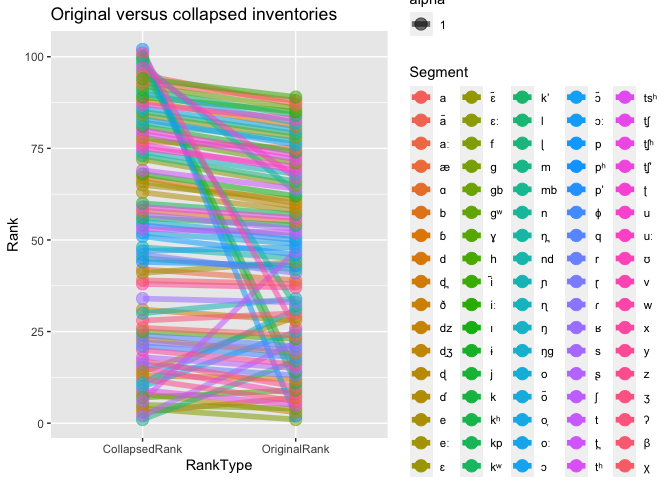
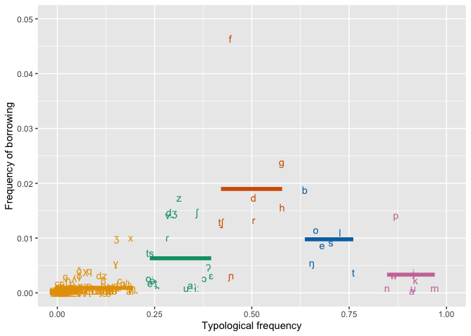

Model 1: A probabilistic model of segment borrowability
================
Steven Moran and Elad Eisen
(23 January, 2023)

- <a href="#overview" id="toc-overview">Overview</a>
- <a href="#data" id="toc-data">Data</a>
- <a href="#analysis" id="toc-analysis">Analysis</a>
  - <a href="#random-sampling" id="toc-random-sampling">Random sampling</a>
  - <a href="#collapse-all-inventories"
    id="toc-collapse-all-inventories">Collapse all inventories</a>
  - <a href="#intersection-of-segments-in-phoible-and-segbo"
    id="toc-intersection-of-segments-in-phoible-and-segbo">Intersection of
    segments in PHOIBLE and SEGBO</a>
  - <a href="#accounting-for-negative-data-in-model-1"
    id="toc-accounting-for-negative-data-in-model-1">Accounting for negative
    data in Model 1</a>
  - <a
    href="#accounting-for-negative-data-in-model-1-with-typological-frequencies-from-phoible"
    id="toc-accounting-for-negative-data-in-model-1-with-typological-frequencies-from-phoible">Accounting
    for negative data in Model 1 with typological frequencies from
    PHOIBLE</a>
- <a href="#compare-the-results" id="toc-compare-the-results">Compare the
  results</a>
- <a href="#figures" id="toc-figures">Figures</a>
- <a href="#other-stats" id="toc-other-stats">Other stats</a>
- <a href="#references" id="toc-references">References</a>

<!-- author: "Steven Moran and Elad Eisen" -->

# Overview

This report includes supplementary materials for:

> > > Operationalizing borrowability: A case study from phonological
> > > segments

And it uses the R programming language (R Core Team 2021) and the
following R libraries (Wickham et al. 2019; Xie 2021).

``` r
library(tidyverse)
library(knitr)
```

# Data

First, load the data from the [CLDF format](https://cldf.clld.org)
(Forkel et al. 2018) and combine the tables into single data frames
including [PHOIBLE](https://phoible.org) (Moran and McCloy 2019) and
[SegBo](https://github.com/segbo-db/segbo) (Grossman et al. 2020).

``` r
values <- read_csv('../data/segbo/cldf/values.csv')
languages <- read_csv('../data/segbo/cldf/languages.csv')
segbo <- left_join(values, languages, by=c("Language_ID"="ID"))

values <- read_csv('../data/phoible/cldf/values.csv')
languages <- read_csv('../data/phoible/cldf/languages.csv')
phoible <- left_join(values, languages, by=c("Language_ID"="ID"))
```

How many languages in SEGBO are also in PHOIBLE? There are currently 498
languages in SegBo, of which 199 are *not* in PHOIBLE.

``` r
tmp1 <- segbo %>% select(Language_ID) %>% distinct()
tmp2 <- phoible %>% select(Language_ID) %>% distinct()
nrow(tmp1)
```

    ## [1] 498

``` r
nrow(tmp1[which(!(tmp1$Language_ID %in% tmp2$Language_ID)),])
```

    ## [1] 199

# Analysis

A segment’s borrowability factor `bS` is calculated by Eisen (2019, 60)
as:

$$
b_s = \frac{P_s}{f_s - f_s^2}
$$

where `Ps` is the probability of borrowing a segment and `fs` is its
typological frequency. Empirical estimations for the probability of
borrowing and the typological frequency are estimated from SegBo and
PHOIBLE, respectively.

Get the typological frequency of segments in phoible.

``` r
num_phoible_inventories <- phoible %>% select(Inventory_ID) %>% distinct() %>% nrow()
phoible_segment_counts <- as.data.frame(table(phoible$Value))
phoible_segment_counts <- phoible_segment_counts %>% rename(Segment = Var1, PhoibleFreq = Freq)
phoible_segment_counts$Segment <- as.character(phoible_segment_counts$Segment)
phoible_segment_counts$PhoibleCrossFreq <- phoible_segment_counts$PhoibleFreq / num_phoible_inventories
```

Get segbo segment frequencies.

``` r
num_segbo_inventories <- segbo %>% select(Inventory_ID) %>% distinct() %>% nrow()
segbo_segment_counts <- as.data.frame(table(segbo$Value))
segbo_segment_counts <- segbo_segment_counts %>% rename(Segment = Var1, SegboFreq = Freq)
segbo_segment_counts$Segment <- as.character(segbo_segment_counts$Segment)
segbo_segment_counts$SegboCrossFreq <- segbo_segment_counts$SegboFreq / num_segbo_inventories
```

Which segments are in segbo that are not in phoible?

``` r
segbo_segment_counts[which(!(segbo_segment_counts$Segment %in% phoible_segment_counts$Segment)),]
```

    ##     Segment SegboFreq SegboCrossFreq
    ## 74       ɨə̯         1    0.001886792
    ## 105     n̺d̺z̺         1    0.001886792
    ## 153       ɹ̤         1    0.001886792
    ## 196     ʊai         1    0.001886792
    ## 214       ʕ̞         1    0.001886792

``` r
# 154   halh1238        Mongolian   svantesson2005mongolian ʊai mand1415 - from Mandarian, perhaps uai
# 285   assa1263    ɹ̤  sans1269 -from Sanskrit
# 304   chra1242    ɨə̯ viet1252-- from Vietnamese
```

Combine SEGBO and PHOIBLE

``` r
bs_df_new <- left_join(segbo_segment_counts, phoible_segment_counts)
```

    ## Joining, by = "Segment"

Calculate all borrowability scores.

``` r
bs_df_new$BorrowabilityScore <- bs_df_new$SegboCrossFreq / (bs_df_new$PhoibleCrossFreq - bs_df_new$PhoibleCrossFreq ^ 2)
# write_csv(bs_df_new, 'all_borrowability_scores.csv')
```

Recall that these borrowability scores are not normalized (i.e. 0–1) and
that the typological frequencies and borrowing frequencies use two
different sets of languages, PHOIBLE and SEGBO samples respectively.
That is, some of the languages from SEGBO are not in PHOIBLE, so
borrowing frequencies can be in excess of their respective typological
frequenies – causing some rare segments borrowability coefficients to be
quite high. For example:

``` r
bs_df_new %>% arrange(desc(BorrowabilityScore)) %>% head(n=20) %>% select(Segment, BorrowabilityScore, PhoibleCrossFreq, SegboCrossFreq) %>% kable()
```

| Segment | BorrowabilityScore | PhoibleCrossFreq | SegboCrossFreq |
|:--------|-------------------:|-----------------:|---------------:|
| ðˤ      |          17.105668 |        0.0006623 |      0.0113208 |
| pˤ      |           5.701889 |        0.0006623 |      0.0037736 |
| ðˠ      |           5.700001 |        0.0003311 |      0.0018868 |
| d̤ɮ̤      |           5.700001 |        0.0003311 |      0.0018868 |
| d̠̤ʒ̤      |           5.700001 |        0.0003311 |      0.0018868 |
| l̪ˤ      |           5.700001 |        0.0003311 |      0.0018868 |
| ʟ       |           5.700001 |        0.0003311 |      0.0018868 |
| ndl     |           5.700001 |        0.0003311 |      0.0018868 |
| n̪ˤ      |           5.700001 |        0.0003311 |      0.0018868 |
| pʃʰ     |           5.700001 |        0.0003311 |      0.0018868 |
| tlʱ     |           5.700001 |        0.0003311 |      0.0018868 |
| tsʲʰ    |           5.700001 |        0.0003311 |      0.0018868 |
| ɕː      |           4.079537 |        0.0023179 |      0.0094340 |
| dˤ      |           4.079537 |        0.0023179 |      0.0094340 |
| zˤ      |           3.570780 |        0.0026490 |      0.0094340 |
| ɮʲ      |           2.852835 |        0.0013245 |      0.0037736 |
| ʡ       |           2.852835 |        0.0013245 |      0.0037736 |
| n̤d̤ɮ̤     |           2.850945 |        0.0006623 |      0.0018868 |
| pʷʰ     |           2.850945 |        0.0006623 |      0.0018868 |
| pʷʼ     |           2.850945 |        0.0006623 |      0.0018868 |

Here we display the top 20 with a cross-linguistic frequency greater
than .05 to get a clearer picture of those segments in both databases.
Below we take the intersection of the two, as per Model 2.

``` r
t <- bs_df_new %>% filter(PhoibleCrossFreq > .05) %>% arrange(desc(BorrowabilityScore)) %>% head(n=20) %>% select(Segment, BorrowabilityScore, PhoibleCrossFreq, SegboCrossFreq)

t <- t %>% rename(Phoneme = Segment, Borrowability = BorrowabilityScore, `Typological Frequency` = PhoibleCrossFreq, `Borrowing Frequency` = SegboCrossFreq)

library(xtable)
# print(xtable(t), include.rownames=FALSE)
t %>% kable()
```

| Phoneme | Borrowability | Typological Frequency | Borrowing Frequency |
|:--------|--------------:|----------------------:|--------------------:|
| f       |     1.1330821 |             0.4403974 |           0.2792453 |
| p       |     0.7460172 |             0.8586093 |           0.0905660 |
| d̠ʒ      |     0.7154228 |             0.2715232 |           0.1415094 |
| ɡ       |     0.6455142 |             0.5668874 |           0.1584906 |
| t̠ʃ      |     0.5566655 |             0.4033113 |           0.1339623 |
| z       |     0.5435886 |             0.2956954 |           0.1132075 |
| b       |     0.5186924 |             0.6311258 |           0.1207547 |
| v       |     0.5166900 |             0.2701987 |           0.1018868 |
| h       |     0.4910408 |             0.5639073 |           0.1207547 |
| ʒ       |     0.4815191 |             0.1582781 |           0.0641509 |
| k       |     0.4117135 |             0.9036424 |           0.0358491 |
| d       |     0.4107821 |             0.4556291 |           0.1018868 |
| r       |     0.3979832 |             0.4410596 |           0.0981132 |
| j       |     0.3959937 |             0.8993377 |           0.0358491 |
| ʃ       |     0.3742237 |             0.3655629 |           0.0867925 |
| x       |     0.3676977 |             0.1900662 |           0.0566038 |
| l       |     0.3622902 |             0.6768212 |           0.0792453 |
| ɸ       |     0.3530705 |             0.0506623 |           0.0169811 |
| ð       |     0.3384500 |             0.0529801 |           0.0169811 |
| ɾ       |     0.2969673 |             0.2562914 |           0.0566038 |

## Random sampling

One problem, however, is that cross-linguistic frequency is treated as
*all* the data points and not just a unique list of languages. So for
example, segments in either data source (PHOIBLE or SEGBO) are counted
multiple times – consider the four inventories for Akan in phoible.

``` r
phoible %>% filter(Glottocode == "akan1250") %>% group_by(Inventory_ID, Glottocode, ISO639P3code, Name) %>% summarize(SegmentCount = n()) %>% kable()
```

    ## `summarise()` has grouped output by 'Inventory_ID', 'Glottocode', 'ISO639P3code'. You can override using the `.groups` argument.

| Inventory_ID | Glottocode | ISO639P3code | Name | SegmentCount |
|-------------:|:-----------|:-------------|:-----|-------------:|
|          140 | akan1250   | aka          | Akan |           40 |
|          208 | akan1250   | aka          | Akan |           35 |
|          655 | akan1250   | aka          | Akan |           31 |
|         1245 | akan1250   | aka          | Akan |           60 |

So, segments that are shared across these inventories are counted more
than one for the “same” language.

Let’s try random sampling one inventory per language from PHOIBLE and
then calculate the borrowability scores. Later we can compare the
results between various samples.

``` r
phoible %>%
    distinct(Inventory_ID, ISO639P3code) %>%
    group_by(ISO639P3code) %>%
    sample_n(1) %>%
    pull(Inventory_ID) ->
    inventory_ids_sampled_one_per_isocode

phoible %>%
    filter(Inventory_ID %in% inventory_ids_sampled_one_per_isocode) ->
    my_sample

num_phoible_inventories <- my_sample %>% select(Inventory_ID) %>% distinct() %>% nrow()
phoible_segment_counts <- as.data.frame(table(my_sample$Value))
phoible_segment_counts <- phoible_segment_counts %>% rename(Segment = Var1, PhoibleFreq = Freq)
phoible_segment_counts$Segment <- as.character(phoible_segment_counts$Segment)
phoible_segment_counts$PhoibleCrossFreq <- phoible_segment_counts$PhoibleFreq / num_phoible_inventories
```

We’ll use the same SEGBO counts from above, even though they produce the
same problem, i.e. there are multiple reports (“inventories”) for the
same language.

Combine SEGBO and random PHOIBLE

``` r
bs_df_random <- left_join(segbo_segment_counts, phoible_segment_counts)
```

    ## Joining, by = "Segment"

Calculate all borrowability scores.

``` r
bs_df_random$BorrowabilityScore <- bs_df_random$SegboCrossFreq / (bs_df_random$PhoibleCrossFreq - bs_df_random$PhoibleCrossFreq ^ 2)
```

Let’s have a look.

``` r
bs_df_random %>% filter(PhoibleCrossFreq > .05) %>% arrange(desc(BorrowabilityScore)) %>% head(n=25) %>% kable()
```

| Segment | SegboFreq | SegboCrossFreq | PhoibleFreq | PhoibleCrossFreq | BorrowabilityScore |
|:--------|----------:|---------------:|------------:|-----------------:|-------------------:|
| f       |       148 |      0.2792453 |         934 |        0.4449738 |          1.1306753 |
| p       |        48 |      0.0905660 |        1799 |        0.8570748 |          0.7393291 |
| d̠ʒ      |        75 |      0.1415094 |         579 |        0.2758456 |          0.7084156 |
| ɡ       |        84 |      0.1584906 |        1205 |        0.5740829 |          0.6481921 |
| t̠ʃ      |        71 |      0.1339623 |         833 |        0.3968556 |          0.5596656 |
| z       |        60 |      0.1132075 |         623 |        0.2968080 |          0.5424077 |
| ʒ       |        34 |      0.0641509 |         298 |        0.1419724 |          0.5266207 |
| b       |        64 |      0.1207547 |        1336 |        0.6364936 |          0.5219128 |
| v       |        54 |      0.1018868 |         577 |        0.2748928 |          0.5111546 |
| h       |        64 |      0.1207547 |        1200 |        0.5717008 |          0.4931602 |
| k       |        19 |      0.0358491 |        1911 |        0.9104335 |          0.4396267 |
| d       |        54 |      0.1018868 |        1010 |        0.4811815 |          0.4081253 |
| r       |        52 |      0.0981132 |         968 |        0.4611720 |          0.3948339 |
| j       |        19 |      0.0358491 |        1884 |        0.8975703 |          0.3899269 |
| x       |        30 |      0.0566038 |         377 |        0.1796093 |          0.3841455 |
| ʃ       |        46 |      0.0867925 |         730 |        0.3477847 |          0.3826313 |
| l       |        42 |      0.0792453 |        1462 |        0.6965222 |          0.3748966 |
| q       |        12 |      0.0226415 |         165 |        0.0786089 |          0.3126006 |
| ɾ       |        30 |      0.0566038 |         523 |        0.2491663 |          0.3025606 |
| s       |        34 |      0.0641509 |        1442 |        0.6869938 |          0.2983303 |
| χ       |         9 |      0.0169811 |         130 |        0.0619343 |          0.2922823 |
| ɣ       |        17 |      0.0320755 |         284 |        0.1353025 |          0.2741593 |
| w       |        18 |      0.0339623 |        1769 |        0.8427823 |          0.2563184 |
| o       |        31 |      0.0584906 |        1334 |        0.6355407 |          0.2525186 |
| ts      |        21 |      0.0396226 |         469 |        0.2234397 |          0.2283536 |

## Collapse all inventories

In contrast to the approach above, [Model
2](../neighbor-graph_model/A%20language-graph-based%20model%20of%20segment%20borrowing.ipynb)
simply collapses all of the duplicate inventories into “single”
languages, instead of randomizing or bootstrapping the samples. Let’s do
the same here for PHOIBLE and SEGBO. Then we can compare the original,
randomly sampled, and all-inventories-as-one language approaches and the
resulting borrowability scores.

``` r
collapsed_inventories <- phoible %>% group_by(ISO639P3code) %>% select(ISO639P3code, Value)

num_phoible_inventories <- collapsed_inventories %>% select(ISO639P3code) %>% distinct() %>% nrow()
phoible_segment_counts <- as.data.frame(table(collapsed_inventories$Value))
phoible_segment_counts <- phoible_segment_counts %>% rename(Segment = Var1, PhoibleFreq = Freq)
phoible_segment_counts$Segment <- as.character(phoible_segment_counts$Segment)
phoible_segment_counts$PhoibleCrossFreq <- phoible_segment_counts$PhoibleFreq / num_phoible_inventories
```

And do the same for SEGBO.

``` r
segbo_collapsed <- segbo %>% group_by(ISO639P3code, Value)
num_segbo_inventories <- segbo %>% select(ISO639P3code) %>% distinct() %>% nrow()
segbo_segment_counts <- as.data.frame(table(segbo_collapsed$Value))
segbo_segment_counts <- segbo_segment_counts %>% rename(Segment = Var1, SegboFreq = Freq)
segbo_segment_counts$Segment <- as.character(segbo_segment_counts$Segment)
segbo_segment_counts$SegboCrossFreq <- segbo_segment_counts$SegboFreq / num_segbo_inventories
```

Combine them and get the borrowability score.

``` r
bs_df_collapsed <- left_join(segbo_segment_counts, phoible_segment_counts)
```

    ## Joining, by = "Segment"

``` r
bs_df_collapsed$BorrowabilityScore <- bs_df_collapsed$SegboCrossFreq / (bs_df_collapsed$PhoibleCrossFreq - bs_df_collapsed$PhoibleCrossFreq ^ 2)
```

Let’s have a look.

``` r
bs_df_collapsed %>% filter(PhoibleCrossFreq > .05) %>% arrange(desc(BorrowabilityScore)) %>% head(n=25) %>% kable()
```

| Segment | SegboFreq | SegboCrossFreq | PhoibleFreq | PhoibleCrossFreq | BorrowabilityScore |
|:--------|----------:|---------------:|------------:|-----------------:|-------------------:|
| l       |        42 |      0.0850202 |        2044 |        0.9737970 |          3.3319896 |
| s       |        34 |      0.0688259 |        2021 |        0.9628394 |          1.9236051 |
| b       |        64 |      0.1295547 |        1906 |        0.9080515 |          1.5516640 |
| f       |       148 |      0.2995951 |        1330 |        0.6336351 |          1.2905703 |
| ɡ       |        84 |      0.1700405 |        1712 |        0.8156265 |          1.1307393 |
| t       |         9 |      0.0182186 |        2064 |        0.9833254 |          1.1111244 |
| h       |        64 |      0.1295547 |        1703 |        0.8113387 |          0.8463852 |
| d̠ʒ      |        75 |      0.1518219 |         820 |        0.3906622 |          0.6377857 |
| t̠ʃ      |        71 |      0.1437247 |        1218 |        0.5802763 |          0.5901101 |
| o       |        31 |      0.0627530 |        1826 |        0.8699381 |          0.5546209 |
| ŋ       |        22 |      0.0445344 |        1898 |        0.9042401 |          0.5143140 |
| z       |        60 |      0.1214575 |         893 |        0.4254407 |          0.4968787 |
| d       |        54 |      0.1093117 |        1376 |        0.6555503 |          0.4840999 |
| e       |        25 |      0.0506073 |        1841 |        0.8770843 |          0.4694231 |
| v       |        54 |      0.1093117 |         816 |        0.3887566 |          0.4600181 |
| r       |        52 |      0.1052632 |        1332 |        0.6345879 |          0.4539434 |
| ʒ       |        34 |      0.0688259 |         478 |        0.2277275 |          0.3913505 |
| ʃ       |        46 |      0.0931174 |        1104 |        0.5259647 |          0.3734768 |
| ʎ       |        10 |      0.0202429 |         147 |        0.0700333 |          0.3108141 |
| x       |        30 |      0.0607287 |         574 |        0.2734636 |          0.3056592 |
| ɸ       |         9 |      0.0182186 |         153 |        0.0728919 |          0.2695915 |
| ɾ       |        30 |      0.0607287 |         774 |        0.3687470 |          0.2608930 |
| ð       |         9 |      0.0182186 |         160 |        0.0762268 |          0.2587275 |
| q       |        12 |      0.0242915 |         256 |        0.1219628 |          0.2268370 |
| ɣ       |        17 |      0.0344130 |         436 |        0.2077180 |          0.2091068 |

## Intersection of segments in PHOIBLE and SEGBO

As per Model 2’s assumptions, here we take the intersection of languages
in SEGBO and PHOIBLE. Recall above that we calculate how many languages
are in both databases. There are 498 languages in SEGBO and 2177 in
PHOIBLE and 199 languages in SEGBO not in PHOIBLE, leaving 299 languages
that are shared by both databases.

``` r
tmp1 <- segbo %>% select(Language_ID) %>% distinct()
tmp2 <- phoible %>% select(Language_ID) %>% distinct()
nrow(tmp1)
```

    ## [1] 498

``` r
nrow(tmp2)
```

    ## [1] 2177

``` r
nrow(tmp1[which(!(tmp1$Language_ID %in% tmp2$Language_ID)),])
```

    ## [1] 199

Subset PHOIBLE to just the languages in Segbo.

``` r
phoible_intersection <- phoible %>% filter(phoible$Language_ID %in% tmp1$Language_ID)
nrow(phoible_intersection %>% distinct(Language_ID))
```

    ## [1] 299

We note again that PHOIBLE contains multiple doculects for the same
language.

``` r
phoible_intersection %>% group_by(Inventory_ID, Glottocode) %>% select(Language_ID, Glottocode) %>% distinct() %>% arrange(Glottocode) %>% head() %>% kable()
```

    ## Adding missing grouping variables: `Inventory_ID`

| Inventory_ID | Language_ID | Glottocode |
|-------------:|:------------|:-----------|
|         1160 | abau1245    | abau1245   |
|          235 | abip1241    | abip1241   |
|         1914 | abip1241    | abip1241   |
|         1093 | achi1257    | achi1257   |
|          712 | adam1253    | adam1253   |
|         1234 | adam1253    | adam1253   |

We simply collapse these different doculects into single phonological
inventories.

``` r
collapsed_inventories <- phoible_intersection %>% group_by(ISO639P3code) %>% select(ISO639P3code, Value)
```

Nevertheless, we still want the typological frequency of segments from
all of PHOIBLE for our borrowability scores.

``` r
num_phoible_inventories <- phoible %>% select(Inventory_ID) %>% distinct() %>% nrow()
phoible_segment_counts <- as.data.frame(table(phoible$Value))
phoible_segment_counts <- phoible_segment_counts %>% rename(Segment = Var1, PhoibleFreq = Freq)
phoible_segment_counts$Segment <- as.character(phoible_segment_counts$Segment)
phoible_segment_counts$PhoibleCrossFreq <- phoible_segment_counts$PhoibleFreq / num_phoible_inventories
```

We also want just the languages in SEGBO that are in PHOIBLE.

``` r
segbo_intersection <- segbo %>% filter(Language_ID %in% phoible$Language_ID)
segbo %>% select(Language_ID) %>% distinct() %>% nrow()
```

    ## [1] 498

``` r
segbo_intersection %>% select(Language_ID) %>% distinct() %>% nrow() # Should also be 299 like above
```

    ## [1] 299

We also collapse doculects in SEGBO.

``` r
segbo_collapsed <- segbo_intersection %>% group_by(ISO639P3code, Value)
```

Now get their segment counts.

``` r
num_segbo_inventories <- segbo_collapsed %>% select(ISO639P3code) %>% distinct() %>% nrow()
```

    ## Adding missing grouping variables: `Value`

``` r
segbo_segment_counts <- as.data.frame(table(segbo_collapsed$Value))
segbo_segment_counts <- segbo_segment_counts %>% rename(Segment = Var1, SegboFreq = Freq)
segbo_segment_counts$Segment <- as.character(segbo_segment_counts$Segment)
segbo_segment_counts$SegboCrossFreq <- segbo_segment_counts$SegboFreq / num_segbo_inventories
```

Combine them.

``` r
bs_df_intersected <- inner_join(segbo_segment_counts, phoible_segment_counts)
```

    ## Joining, by = "Segment"

Calculate all borrowability scores.

``` r
bs_df_intersected$BorrowabilityScore <- bs_df_intersected$SegboCrossFreq / (bs_df_intersected$PhoibleCrossFreq - bs_df_intersected$PhoibleCrossFreq ^ 2)
```

Let’s have a look.

``` r
bs_df_intersected %>% arrange(desc(BorrowabilityScore)) %>% head(n=25) %>% kable()
```

| Segment | SegboFreq | SegboCrossFreq | PhoibleFreq | PhoibleCrossFreq | BorrowabilityScore |
|:--------|----------:|---------------:|------------:|-----------------:|-------------------:|
| ðˤ      |         2 |      0.0019436 |           2 |        0.0006623 |          2.9368332 |
| ðˠ      |         1 |      0.0009718 |           1 |        0.0003311 |          2.9358604 |
| d̠̤ʒ̤      |         1 |      0.0009718 |           1 |        0.0003311 |          2.9358604 |
| l̪ˤ      |         1 |      0.0009718 |           1 |        0.0003311 |          2.9358604 |
| n̪ˤ      |         1 |      0.0009718 |           1 |        0.0003311 |          2.9358604 |
| tsʲʰ    |         1 |      0.0009718 |           1 |        0.0003311 |          2.9358604 |
| ɕː      |         4 |      0.0038873 |           7 |        0.0023179 |          1.6809753 |
| ɮʲ      |         2 |      0.0019436 |           4 |        0.0013245 |          1.4693903 |
| pʷʰ     |         1 |      0.0009718 |           2 |        0.0006623 |          1.4684166 |
| pʷʼ     |         1 |      0.0009718 |           2 |        0.0006623 |          1.4684166 |
| pˤ      |         1 |      0.0009718 |           2 |        0.0006623 |          1.4684166 |
| ɸʷ      |         1 |      0.0009718 |           2 |        0.0006623 |          1.4684166 |
| uə̯      |         1 |      0.0009718 |           2 |        0.0006623 |          1.4684166 |
| tˠ      |         1 |      0.0009718 |           3 |        0.0009934 |          0.9792689 |
| ʊa      |         1 |      0.0009718 |           3 |        0.0009934 |          0.9792689 |
| tˤ      |         2 |      0.0019436 |           8 |        0.0026490 |          0.7356709 |
| dzʱ     |         1 |      0.0009718 |           4 |        0.0013245 |          0.7346952 |
| r̝       |         1 |      0.0009718 |           4 |        0.0013245 |          0.7346952 |
| ʡ       |         1 |      0.0009718 |           4 |        0.0013245 |          0.7346952 |
| sˤ      |         2 |      0.0019436 |          10 |        0.0033113 |          0.5889277 |
| œ̃ː      |         1 |      0.0009718 |           5 |        0.0016556 |          0.5879511 |
| sˠ      |         1 |      0.0009718 |           5 |        0.0016556 |          0.5879511 |
| tsʷʰ    |         1 |      0.0009718 |           5 |        0.0016556 |          0.5879511 |
| ɣʲ      |         1 |      0.0009718 |           6 |        0.0019868 |          0.4901218 |
| œ̃       |         1 |      0.0009718 |           6 |        0.0019868 |          0.4901218 |

## Accounting for negative data in Model 1

So it turns out that the problem of negative data was present in Model 1
all along:

1.  Either borrowing_relative_frequency should also be computed with
    num_phoible_inventories in the denominator, or
2.  We should indeed take the intersection of SEGBO and PHOIBLE for
    typological_relative_frequency as well.

Approach 1:

``` r
# Let's start with computing borrowing relative frequency with the number of inventories in phoible in the denominator of our borrowability equation.
# bs_df_new$BorrowabilityScore <- bs_df_new$SegboCrossFreq / (bs_df_new$PhoibleCrossFreq - bs_df_new$PhoibleCrossFreq ^ 2)
```

Approach 2:

Let’s take the intersection of SEGBO and PHOIBLE for borrowing and
typological relative frequency.

``` r
tmp1 <- segbo %>% select(Language_ID) %>% distinct()
tmp2 <- phoible %>% select(Language_ID) %>% distinct()
nrow(tmp1)
```

    ## [1] 498

``` r
nrow(tmp2)
```

    ## [1] 2177

``` r
nrow(tmp1[which(!(tmp1$Language_ID %in% tmp2$Language_ID)),])
```

    ## [1] 199

``` r
shared_glottocodes <- intersect(tmp1$Language_ID, tmp2$Language_ID)
length(shared_glottocodes)
```

    ## [1] 299

Subset PHOIBLE to just the languages in Segbo.

``` r
phoible_intersection <- phoible %>% filter(phoible$Language_ID %in% shared_glottocodes)
nrow(phoible_intersection %>% distinct(Language_ID))
```

    ## [1] 299

We note again that PHOIBLE contains multiple doculects for the same
language.

``` r
phoible_intersection %>% group_by(Inventory_ID, Glottocode) %>% select(Language_ID, Glottocode) %>% distinct() %>% arrange(Glottocode) %>% head() %>% kable()
```

    ## Adding missing grouping variables: `Inventory_ID`

| Inventory_ID | Language_ID | Glottocode |
|-------------:|:------------|:-----------|
|         1160 | abau1245    | abau1245   |
|          235 | abip1241    | abip1241   |
|         1914 | abip1241    | abip1241   |
|         1093 | achi1257    | achi1257   |
|          712 | adam1253    | adam1253   |
|         1234 | adam1253    | adam1253   |

We simply collapse these different doculects into single phonological
inventories. The result is that if two phonological descriptions of the
same dialect or language (as determined by their Glottocode) are
different, e.g., one author posits 5 vowels and another 10 vowels, i.e.,
they present evidence for phonemic vowel length, then the resulting
collapsed inventories is the union of the two vowel inventories.

``` r
collapsed_inventories <- phoible_intersection %>% select(Glottocode, Value) %>% group_by(Glottocode, Value) %>% distinct() %>% ungroup()
nrow(collapsed_inventories %>% select(Glottocode) %>% distinct())
```

    ## [1] 299

We also want just the languages in SEGBO that are in PHOIBLE.

``` r
segbo_intersection <- segbo %>% filter(Language_ID %in% shared_glottocodes)
segbo_intersection %>% select(Language_ID) %>% distinct() %>% nrow() # Should also be 299 like above
```

    ## [1] 299

We also collapse doculects in SEGBO.

``` r
segbo_collapsed <- segbo_intersection %>% select(Language_ID, Value) %>% group_by(Language_ID, Value) %>% distinct() %>% ungroup()
segbo_collapsed <- segbo_collapsed %>% rename(Glottocode = Language_ID)
nrow(segbo_collapsed %>% select(Glottocode) %>% distinct())
```

    ## [1] 299

Now we are dealing with two potentially different samples. For example,
if segment X occurs in a description (a doculect) in SEGBO, i.e., it is
reported as a borrowed segment – but that doculect is not in PHOIBLE,
but another description is that e.g., does not describe borrowed
segments – then our “language” samples between databases differs. The
result after applying the conditional probability borrowing equation
will result in results outside the range of 0-1. Examples are given in
the next section.

To alleivate this issue, we make further assumption. In the few cases
that different doculects represent the same dialect of language at the
intersection of the two databases (PHOIBLE and SEGBO), borrowed segments
are intersected (and if they aren’t reported in PHOIBLE added to the
inventory) in PHOIBLE.

``` r
collapsed_inventories <- rbind(collapsed_inventories, segbo_collapsed)
collapsed_inventories <- collapsed_inventories %>% group_by(Glottocode, Value) %>% distinct() %>% ungroup()
nrow(collapsed_inventories %>% select(Glottocode) %>% distinct())
```

    ## [1] 299

Total inventories.

``` r
length(unique(segbo_collapsed$Glottocode))
```

    ## [1] 299

``` r
length(unique(collapsed_inventories$Glottocode))
```

    ## [1] 299

``` r
# collapsed_inventories[which(!(unique(collapsed_inventories$ISO639P3code) %in% unique(segbo_collapsed$ISO639P3code))),]
```

Now get their respective segment counts and use the size of the
intersected language sample in our borrowability equation.

``` r
phoible_segment_counts <- as.data.frame(table(collapsed_inventories$Value))
phoible_segment_counts <- phoible_segment_counts %>% rename(Segment = Var1, PhoibleFreq = Freq)
phoible_segment_counts$Segment <- as.character(phoible_segment_counts$Segment)
phoible_segment_counts$PhoibleCrossFreq <- phoible_segment_counts$PhoibleFreq / length(shared_glottocodes)

any(phoible_segment_counts$PhoibleCrossFreq > 1)
```

    ## [1] FALSE

``` r
any(phoible_segment_counts$PhoibleCrossFreq < 0)
```

    ## [1] FALSE

``` r
segbo_segment_counts <- as.data.frame(table(segbo_collapsed$Value))
segbo_segment_counts <- segbo_segment_counts %>% rename(Segment = Var1, SegboFreq = Freq)
segbo_segment_counts$Segment <- as.character(segbo_segment_counts$Segment)
segbo_segment_counts$SegboCrossFreq <- segbo_segment_counts$SegboFreq / length(shared_glottocodes)

any(segbo_segment_counts$PhoibleCrossFreq > 1)
```

    ## [1] FALSE

``` r
any(segbo_segment_counts$PhoibleCrossFreq < 0)
```

    ## [1] FALSE

Combine them.

``` r
bs_df_intersected_merged <- inner_join(segbo_segment_counts, phoible_segment_counts)
```

    ## Joining, by = "Segment"

Calculate borrowability scores.

``` r
bs_df_intersected_merged$BorrowabilityScore <- bs_df_intersected_merged$SegboCrossFreq / (bs_df_intersected_merged$PhoibleCrossFreq - bs_df_intersected_merged$PhoibleCrossFreq ^ 2)
```

Let’s have a look. But we still get values over one…

``` r
bs_df_intersected_merged %>% arrange(desc(BorrowabilityScore)) %>% head(n=25) %>% kable()
```

| Segment | SegboFreq | SegboCrossFreq | PhoibleFreq | PhoibleCrossFreq | BorrowabilityScore |
|:--------|----------:|---------------:|------------:|-----------------:|-------------------:|
| p       |        31 |      0.1036789 |         278 |        0.9297659 |           1.587701 |
| f       |       101 |      0.3377926 |         191 |        0.6387960 |           1.463981 |
| ðˠ      |         1 |      0.0033445 |           1 |        0.0033445 |           1.003356 |
| dzʱ     |         1 |      0.0033445 |           1 |        0.0033445 |           1.003356 |
| d̠̤ʒ̤      |         1 |      0.0033445 |           1 |        0.0033445 |           1.003356 |
| ɨə̯      |         1 |      0.0033445 |           1 |        0.0033445 |           1.003356 |
| l̪ˤ      |         1 |      0.0033445 |           1 |        0.0033445 |           1.003356 |
| mbʷ     |         1 |      0.0033445 |           1 |        0.0033445 |           1.003356 |
| ɱ       |         1 |      0.0033445 |           1 |        0.0033445 |           1.003356 |
| n̺d̺z̺     |         1 |      0.0033445 |           1 |        0.0033445 |           1.003356 |
| n̪ˤ      |         1 |      0.0033445 |           1 |        0.0033445 |           1.003356 |
| œ̃ː      |         1 |      0.0033445 |           1 |        0.0033445 |           1.003356 |
| pʷ      |         1 |      0.0033445 |           1 |        0.0033445 |           1.003356 |
| pʷʰ     |         1 |      0.0033445 |           1 |        0.0033445 |           1.003356 |
| pʷʼ     |         1 |      0.0033445 |           1 |        0.0033445 |           1.003356 |
| pˤ      |         1 |      0.0033445 |           1 |        0.0033445 |           1.003356 |
| ɸʷ      |         1 |      0.0033445 |           1 |        0.0033445 |           1.003356 |
| ɹ̤       |         1 |      0.0033445 |           1 |        0.0033445 |           1.003356 |
| tˠ      |         1 |      0.0033445 |           1 |        0.0033445 |           1.003356 |
| tsʷ     |         1 |      0.0033445 |           1 |        0.0033445 |           1.003356 |
| tsʷʰ    |         1 |      0.0033445 |           1 |        0.0033445 |           1.003356 |
| uə̯      |         1 |      0.0033445 |           1 |        0.0033445 |           1.003356 |
| ʊa      |         1 |      0.0033445 |           1 |        0.0033445 |           1.003356 |
| ʊai     |         1 |      0.0033445 |           1 |        0.0033445 |           1.003356 |
| ʕ̞       |         1 |      0.0033445 |           1 |        0.0033445 |           1.003356 |

Try to repair the algorithm wit

P(contact) = 6 \* fs \* (1 - fs)

and because of normalization, so:

P(borrowing) = P(contact) \* P(borrowing\|contact) = 6 \* fs \* (1 - fs)
\* bs

and

bs = Ps / (fs - fs^2) / 6

So, re-calculate borrowability scores.

``` r
bs_df_intersected_merged$BorrowabilityScore <- bs_df_intersected_merged$SegboCrossFreq / (bs_df_intersected_merged$PhoibleCrossFreq - bs_df_intersected_merged$PhoibleCrossFreq ^ 2) / 6
```

But x / (x-x^2) still tends to infinity as x tends to 1, and surpasses 6
somewhere after x = 0.8 \[here\](
(<https://www.wolframalpha.com/input?i=plot+x+%2F+%28x+-+x%5E2%29+from+0+to+1>).

We note that given the nature of the data sets, if we see 1 occurrence
of borrowed segment X in SEGBO and also just 1 occurrence of it in
PHOIBLE, it means that the only occurrence of that documented sound is
borrowed – which theoretically could be the case intersected between
these two databases.

And this may actually happen even with the best possible data: if a
language borrowed a rare segment from another language and then the
latter than quickly lost it, it may be recorded as recent borrowing in
one language and not recorded at all in another or anywhere else.

Again, this is marginal, so we can be upfront about this. Or we can
apply Laplace smoothing and bump up typological frequencies of all
segments by 1 (unless they appear in all languages) to break the ties.

Have a look.

``` r
bs_df_intersected_merged %>% arrange(desc(BorrowabilityScore)) %>% head(n=25) %>% kable()
```

| Segment | SegboFreq | SegboCrossFreq | PhoibleFreq | PhoibleCrossFreq | BorrowabilityScore |
|:--------|----------:|---------------:|------------:|-----------------:|-------------------:|
| p       |        31 |      0.1036789 |         278 |        0.9297659 |          0.2646169 |
| f       |       101 |      0.3377926 |         191 |        0.6387960 |          0.2439968 |
| ðˠ      |         1 |      0.0033445 |           1 |        0.0033445 |          0.1672260 |
| dzʱ     |         1 |      0.0033445 |           1 |        0.0033445 |          0.1672260 |
| d̠̤ʒ̤      |         1 |      0.0033445 |           1 |        0.0033445 |          0.1672260 |
| ɨə̯      |         1 |      0.0033445 |           1 |        0.0033445 |          0.1672260 |
| l̪ˤ      |         1 |      0.0033445 |           1 |        0.0033445 |          0.1672260 |
| mbʷ     |         1 |      0.0033445 |           1 |        0.0033445 |          0.1672260 |
| ɱ       |         1 |      0.0033445 |           1 |        0.0033445 |          0.1672260 |
| n̺d̺z̺     |         1 |      0.0033445 |           1 |        0.0033445 |          0.1672260 |
| n̪ˤ      |         1 |      0.0033445 |           1 |        0.0033445 |          0.1672260 |
| œ̃ː      |         1 |      0.0033445 |           1 |        0.0033445 |          0.1672260 |
| pʷ      |         1 |      0.0033445 |           1 |        0.0033445 |          0.1672260 |
| pʷʰ     |         1 |      0.0033445 |           1 |        0.0033445 |          0.1672260 |
| pʷʼ     |         1 |      0.0033445 |           1 |        0.0033445 |          0.1672260 |
| pˤ      |         1 |      0.0033445 |           1 |        0.0033445 |          0.1672260 |
| ɸʷ      |         1 |      0.0033445 |           1 |        0.0033445 |          0.1672260 |
| ɹ̤       |         1 |      0.0033445 |           1 |        0.0033445 |          0.1672260 |
| tˠ      |         1 |      0.0033445 |           1 |        0.0033445 |          0.1672260 |
| tsʷ     |         1 |      0.0033445 |           1 |        0.0033445 |          0.1672260 |
| tsʷʰ    |         1 |      0.0033445 |           1 |        0.0033445 |          0.1672260 |
| uə̯      |         1 |      0.0033445 |           1 |        0.0033445 |          0.1672260 |
| ʊa      |         1 |      0.0033445 |           1 |        0.0033445 |          0.1672260 |
| ʊai     |         1 |      0.0033445 |           1 |        0.0033445 |          0.1672260 |
| ʕ̞       |         1 |      0.0033445 |           1 |        0.0033445 |          0.1672260 |

## Accounting for negative data in Model 1 with typological frequencies from PHOIBLE

Now let’s try the same intersection model, but with typological
frequencies from ALL of PHOIBLE.

``` r
num_phoible_inventories <- phoible %>% select(Inventory_ID) %>% distinct() %>% nrow()
phoible_segment_counts <- as.data.frame(table(phoible$Value))
phoible_segment_counts <- phoible_segment_counts %>% rename(Segment = Var1, PhoibleFreq = Freq)
phoible_segment_counts$Segment <- as.character(phoible_segment_counts$Segment)
phoible_segment_counts$PhoibleCrossFreq <- phoible_segment_counts$PhoibleFreq / num_phoible_inventories

any(phoible_segment_counts$PhoibleCrossFreq > 1)
```

    ## [1] FALSE

``` r
any(phoible_segment_counts$PhoibleCrossFreq < 0)
```

    ## [1] FALSE

Combine them.

``` r
bs_df_intersected_merged_all_phoible <- inner_join(segbo_segment_counts, phoible_segment_counts)
```

    ## Joining, by = "Segment"

Calculate borrowability scores with the new formula.

``` r
bs_df_intersected_merged_all_phoible$BorrowabilityScore <- bs_df_intersected_merged_all_phoible$SegboCrossFreq / (bs_df_intersected_merged_all_phoible$PhoibleCrossFreq - bs_df_intersected_merged_all_phoible$PhoibleCrossFreq ^ 2) / 6
```

Let’s have a look. But we still get values over one…

``` r
bs_df_intersected_merged_all_phoible %>% arrange(desc(BorrowabilityScore)) %>% head(n=25) %>% kable()
```

| Segment | SegboFreq | SegboCrossFreq | PhoibleFreq | PhoibleCrossFreq | BorrowabilityScore |
|:--------|----------:|---------------:|------------:|-----------------:|-------------------:|
| ðˠ      |         1 |      0.0033445 |           1 |        0.0003311 |          1.6839467 |
| d̠̤ʒ̤      |         1 |      0.0033445 |           1 |        0.0003311 |          1.6839467 |
| l̪ˤ      |         1 |      0.0033445 |           1 |        0.0003311 |          1.6839467 |
| n̪ˤ      |         1 |      0.0033445 |           1 |        0.0003311 |          1.6839467 |
| tsʲʰ    |         1 |      0.0033445 |           1 |        0.0003311 |          1.6839467 |
| ɕː      |         4 |      0.0133779 |           7 |        0.0023179 |          0.9641714 |
| ðˤ      |         1 |      0.0033445 |           2 |        0.0006623 |          0.8422523 |
| pʷʰ     |         1 |      0.0033445 |           2 |        0.0006623 |          0.8422523 |
| pʷʼ     |         1 |      0.0033445 |           2 |        0.0006623 |          0.8422523 |
| pˤ      |         1 |      0.0033445 |           2 |        0.0006623 |          0.8422523 |
| ɸʷ      |         1 |      0.0033445 |           2 |        0.0006623 |          0.8422523 |
| uə̯      |         1 |      0.0033445 |           2 |        0.0006623 |          0.8422523 |
| tˠ      |         1 |      0.0033445 |           3 |        0.0009934 |          0.5616877 |
| ʊa      |         1 |      0.0033445 |           3 |        0.0009934 |          0.5616877 |
| tˤ      |         2 |      0.0066890 |           8 |        0.0026490 |          0.4219651 |
| dzʱ     |         1 |      0.0033445 |           4 |        0.0013245 |          0.4214054 |
| ɮʲ      |         1 |      0.0033445 |           4 |        0.0013245 |          0.4214054 |
| r̝       |         1 |      0.0033445 |           4 |        0.0013245 |          0.4214054 |
| ʡ       |         1 |      0.0033445 |           4 |        0.0013245 |          0.4214054 |
| sˤ      |         2 |      0.0066890 |          10 |        0.0033113 |          0.3377963 |
| œ̃ː      |         1 |      0.0033445 |           5 |        0.0016556 |          0.3372362 |
| sˠ      |         1 |      0.0033445 |           5 |        0.0016556 |          0.3372362 |
| tsʷʰ    |         1 |      0.0033445 |           5 |        0.0016556 |          0.3372362 |
| ɣʲ      |         1 |      0.0033445 |           6 |        0.0019868 |          0.2811234 |
| œ̃       |         1 |      0.0033445 |           6 |        0.0019868 |          0.2811234 |

# Compare the results

Compare the results (but not the intersection results).

``` r
bs_df_new_cut <- bs_df_new %>% select(Segment, PhoibleCrossFreq, BorrowabilityScore)
bs_df_collapsed_cut <- bs_df_collapsed %>% select(Segment, BorrowabilityScore)%>% rename(BorrowabilityScore_collapsed = BorrowabilityScore)
bs_df_random_cut <- bs_df_random %>% select(Segment, BorrowabilityScore) %>% rename(BorrowabilityScore_random = BorrowabilityScore)
bs_df_intersected <- bs_df_intersected %>% select(Segment, BorrowabilityScore) %>% rename(BorrowabilityScore_intersection = BorrowabilityScore)
bs_df_intersected_merged <- bs_df_intersected_merged %>% select(Segment, BorrowabilityScore) %>% rename(BorrowabilityScore_no_neg_data = BorrowabilityScore)
bs_df_intersected_merged_all_phoible <- bs_df_intersected_merged_all_phoible %>% select(Segment, BorrowabilityScore) %>% rename(BorrowabilityScore_no_neg_data_all_phoible = BorrowabilityScore)

results <- left_join(bs_df_intersected_merged_all_phoible, bs_df_intersected_merged)
```

    ## Joining, by = "Segment"

``` r
results <- left_join(results, bs_df_new_cut)
```

    ## Joining, by = "Segment"

``` r
results <- left_join(results, bs_df_collapsed_cut)
```

    ## Joining, by = "Segment"

``` r
results <- left_join(results, bs_df_random_cut)
```

    ## Joining, by = "Segment"

``` r
results <- left_join(results, bs_df_intersected)
```

    ## Joining, by = "Segment"

Have a look at all.

``` r
results %>% arrange(desc(BorrowabilityScore_no_neg_data_all_phoible)) %>% head(n=25) %>% kable()
```

| Segment | BorrowabilityScore_no_neg_data_all_phoible | BorrowabilityScore_no_neg_data | PhoibleCrossFreq | BorrowabilityScore | BorrowabilityScore_collapsed | BorrowabilityScore_random | BorrowabilityScore_intersection |
|:--------|-------------------------------------------:|-------------------------------:|-----------------:|-------------------:|-----------------------------:|--------------------------:|--------------------------------:|
| ðˠ      |                                  1.6839467 |                      0.1672260 |        0.0003311 |          5.7000006 |                    4.2510131 |                 3.9622651 |                       2.9358604 |
| d̠̤ʒ̤      |                                  1.6839467 |                      0.1672260 |        0.0003311 |          5.7000006 |                    4.2510131 |                 3.9622651 |                       2.9358604 |
| l̪ˤ      |                                  1.6839467 |                      0.1672260 |        0.0003311 |          5.7000006 |                    4.2510131 |                 3.9622651 |                       2.9358604 |
| n̪ˤ      |                                  1.6839467 |                      0.1672260 |        0.0003311 |          5.7000006 |                    4.2510131 |                 3.9622651 |                       2.9358604 |
| tsʲʰ    |                                  1.6839467 |                      0.0838945 |        0.0003311 |          5.7000006 |                    4.2510131 |                 3.9622651 |                       2.9358604 |
| ɕː      |                                  0.9641714 |                      0.0975212 |        0.0023179 |          4.0795367 |                    3.0451466 |                 3.9698338 |                       1.6809753 |
| ðˤ      |                                  0.8422523 |                      0.0838945 |        0.0006623 |         17.1056679 |                   12.7591209 |                11.8924636 |                       2.9368332 |
| pʷʰ     |                                  0.8422523 |                      0.1672260 |        0.0006623 |          2.8509446 |                    2.1265201 |                 3.9622651 |                       1.4684166 |
| pʷʼ     |                                  0.8422523 |                      0.1672260 |        0.0006623 |          2.8509446 |                    2.1265201 |                 3.9622651 |                       1.4684166 |
| pˤ      |                                  0.8422523 |                      0.1672260 |        0.0006623 |          5.7018893 |                    4.2530403 |                 3.9641545 |                       1.4684166 |
| ɸʷ      |                                  0.8422523 |                      0.1672260 |        0.0006623 |          2.8509446 |                    2.1265201 |                 3.9622651 |                       1.4684166 |
| uə̯      |                                  0.8422523 |                      0.1672260 |        0.0006623 |          2.8509446 |                    2.1265201 |                 3.9622651 |                       1.4684166 |
| tˠ      |                                  0.5616877 |                      0.1672260 |        0.0009934 |          1.9012597 |                    1.4183565 |                 1.3220153 |                       0.9792689 |
| ʊa      |                                  0.5616877 |                      0.1672260 |        0.0009934 |          1.9012597 |                    1.4183565 |                 1.9820773 |                       0.9792689 |
| tˤ      |                                  0.4219651 |                      0.0566932 |        0.0026490 |          1.4283119 |                    1.0663110 |                 1.5879335 |                       0.7356709 |
| dzʱ     |                                  0.4214054 |                      0.1672260 |        0.0013245 |          1.4264176 |                    1.0642751 |                 0.9919847 |                       0.7346952 |
| ɮʲ      |                                  0.4214054 |                      0.0838945 |        0.0013245 |          2.8528352 |                    2.1285502 |                 3.9641545 |                       1.4693903 |
| r̝       |                                  0.4214054 |                      0.0838945 |        0.0013245 |          1.4264176 |                    1.0642751 |                 1.9820773 |                       0.7346952 |
| ʡ       |                                  0.4214054 |                      0.0838945 |        0.0013245 |          2.8528352 |                    2.1285502 |                 2.6440306 |                       0.7346952 |
| sˤ      |                                  0.3377963 |                      0.0566932 |        0.0033113 |          1.1434088 |                    0.8538655 |                 0.9938824 |                       0.5889277 |
| œ̃ː      |                                  0.3372362 |                      0.1672260 |        0.0016556 |          1.1415126 |                    0.8518267 |                 1.3220153 |                       0.5879511 |
| sˠ      |                                  0.3372362 |                      0.0838945 |        0.0016556 |          1.1415126 |                    0.8518267 |                 1.3220153 |                       0.5879511 |
| tsʷʰ    |                                  0.3372362 |                      0.1672260 |        0.0016556 |          1.1415126 |                    0.8518267 |                 1.3220153 |                       0.5879511 |
| ɣʲ      |                                  0.2811234 |                      0.0838945 |        0.0019868 |          0.9515761 |                    0.7101947 |                 1.3220153 |                       0.4901218 |
| œ̃       |                                  0.2811234 |                      0.0561186 |        0.0019868 |          0.9515761 |                    0.7101947 |                 0.7939668 |                       0.4901218 |

Have a look at typologically frequent segments reported in PHOIBLE.

``` r
results %>% filter(PhoibleCrossFreq > .05) %>% arrange(desc(BorrowabilityScore)) %>% head(n=25) %>% kable()
```

| Segment | BorrowabilityScore_no_neg_data_all_phoible | BorrowabilityScore_no_neg_data | PhoibleCrossFreq | BorrowabilityScore | BorrowabilityScore_collapsed | BorrowabilityScore_random | BorrowabilityScore_intersection |
|:--------|-------------------------------------------:|-------------------------------:|-----------------:|-------------------:|-----------------------------:|--------------------------:|--------------------------------:|
| f       |                                  0.2284412 |                      0.2439968 |        0.4403974 |          1.1330821 |                    1.2905703 |                 1.1306753 |                       0.4022169 |
| p       |                                  0.1423386 |                      0.2646169 |        0.8586093 |          0.7460172 |                   -0.3342025 |                 0.7393291 |                       0.2481589 |
| d̠ʒ      |                                  0.0901789 |                      0.0733180 |        0.2715232 |          0.7154228 |                    0.6377857 |                 0.7084156 |                       0.1572215 |
| ɡ       |                                  0.1180547 |                      0.1467512 |        0.5668874 |          0.6455142 |                    1.1307393 |                 0.6481921 |                       0.2058213 |
| t̠ʃ      |                                  0.0648556 |                      0.0646167 |        0.4033113 |          0.5566655 |                    0.5901101 |                 0.5596656 |                       0.1171101 |
| z       |                                  0.1017082 |                      0.0870651 |        0.2956954 |          0.5435886 |                    0.4968787 |                 0.5424077 |                       0.1773222 |
| b       |                                  0.0981674 |                      0.1300717 |        0.6311258 |          0.5186924 |                    1.5516640 |                 0.5219128 |                       0.1753233 |
| v       |                                  0.0876297 |                      0.0751963 |        0.2701987 |          0.5166900 |                    0.4600181 |                 0.5111546 |                       0.1527772 |
| h       |                                  0.0770673 |                      0.0906545 |        0.5639073 |          0.4910408 |                    0.8463852 |                 0.4931602 |                       0.1343622 |
| ʒ       |                                  0.0920472 |                      0.0652579 |        0.1582781 |          0.4815191 |                    0.3913505 |                 0.5266207 |                       0.1604788 |
| k       |                                  0.0320085 |                      0.0519747 |        0.9036424 |          0.4117135 |                   -0.0985615 |                 0.4396267 |                       0.0892878 |
| d       |                                  0.0853994 |                      0.0874754 |        0.4556291 |          0.4107821 |                    0.4840999 |                 0.4081253 |                       0.1488887 |
| r       |                                  0.0655711 |                      0.0692528 |        0.4410596 |          0.3979832 |                    0.4539434 |                 0.3948339 |                       0.1182614 |
| j       |                                  0.0492581 |                      0.0479859 |        0.8993377 |          0.3959937 |                   -0.1011199 |                 0.3899269 |                       0.0858786 |
| ʃ       |                                  0.0769089 |                      0.0723402 |        0.3655629 |          0.3742237 |                    0.3734768 |                 0.3826313 |                       0.1340861 |
| x       |                                  0.0796610 |                      0.0548221 |        0.1900662 |          0.3676977 |                    0.3056592 |                 0.3841455 |                       0.1388842 |
| l       |                                  0.0611606 |                      0.0931174 |        0.6768212 |          0.3622902 |                    3.3319896 |                 0.3748966 |                       0.1066299 |
| ɸ       |                                  0.0811279 |                      0.0528535 |        0.0506623 |          0.3530705 |                    0.2695915 |                 0.3672935 |                       0.1414417 |
| ð       |                                  0.0999880 |                      0.0572797 |        0.0529801 |          0.3384500 |                    0.2587275 |                 0.3778560 |                       0.1743231 |
| ɾ       |                                  0.0643374 |                      0.0519836 |        0.2562914 |          0.2969673 |                    0.2608930 |                 0.3025606 |                       0.1121684 |
| q       |                                  0.0646630 |                      0.0343994 |        0.0847682 |          0.2918376 |                    0.2268370 |                 0.3126006 |                       0.1127361 |
| s       |                                  0.0503605 |                      0.0742673 |        0.6692053 |          0.2897912 |                    1.9236051 |                 0.2983303 |                       0.0878004 |
| ɣ       |                                  0.0541494 |                      0.0397606 |        0.1443709 |          0.2596617 |                    0.2091068 |                 0.2741593 |                       0.0944063 |
| χ       |                                  0.0758687 |                      0.0442308 |        0.0711921 |          0.2568084 |                    0.1981623 |                 0.2922823 |                       0.1322725 |
| o       |                                  0.0582943 |                      0.0642845 |        0.6046358 |          0.2446778 |                    0.5546209 |                 0.2525186 |                       0.1016327 |

Let’s write the data to disk.

``` r
write_csv(results, 'borrowability_scores.csv')
```

Compare the segment borrowability rankings.

``` r
bs_df_new_cut <- bs_df_new %>% filter(PhoibleCrossFreq > .05) %>% select(Segment, PhoibleCrossFreq, BorrowabilityScore) %>% arrange(desc(BorrowabilityScore))

bs_df_new_cut$OriginalRank <- seq.int(nrow(bs_df_new_cut))

bs_df_collapsed_cut <- bs_df_collapsed %>% filter(PhoibleCrossFreq > .05) %>% select(Segment, BorrowabilityScore) %>% arrange(desc(BorrowabilityScore))

bs_df_collapsed_cut$CollapsedRank <- seq.int(nrow(bs_df_collapsed_cut))

bs_df_random_cut <- bs_df_random %>% filter(PhoibleCrossFreq > .05) %>% select(Segment, BorrowabilityScore) %>% arrange(desc(BorrowabilityScore))

bs_df_random_cut$RandomizedRank <- seq.int(nrow(bs_df_random_cut))

results <- left_join(bs_df_new_cut, bs_df_collapsed_cut, by = c("Segment"="Segment"))
results <- left_join(results, bs_df_random_cut, by = c("Segment"="Segment"))
```

Let’s have a look.

``` r
tmp <- results %>% select(-BorrowabilityScore, -BorrowabilityScore.x, -BorrowabilityScore.y)
tmp %>% kable()
```

| Segment | PhoibleCrossFreq | OriginalRank | CollapsedRank | RandomizedRank |
|:--------|-----------------:|-------------:|--------------:|---------------:|
| f       |        0.4403974 |            1 |             4 |              1 |
| p       |        0.8586093 |            2 |           102 |              2 |
| d̠ʒ      |        0.2715232 |            3 |             8 |              3 |
| ɡ       |        0.5668874 |            4 |             5 |              4 |
| t̠ʃ      |        0.4033113 |            5 |             9 |              5 |
| z       |        0.2956954 |            6 |            12 |              6 |
| b       |        0.6311258 |            7 |             3 |              8 |
| v       |        0.2701987 |            8 |            15 |              9 |
| h       |        0.5639073 |            9 |             7 |             10 |
| ʒ       |        0.1582781 |           10 |            17 |              7 |
| k       |        0.9036424 |           11 |            99 |             11 |
| d       |        0.4556291 |           12 |            13 |             12 |
| r       |        0.4410596 |           13 |            16 |             13 |
| j       |        0.8993377 |           14 |           100 |             14 |
| ʃ       |        0.3655629 |           15 |            18 |             16 |
| x       |        0.1900662 |           16 |            20 |             15 |
| l       |        0.6768212 |           17 |             1 |             17 |
| ɸ       |        0.0506623 |           18 |            21 |             NA |
| ð       |        0.0529801 |           19 |            23 |             NA |
| ɾ       |        0.2562914 |           20 |            22 |             19 |
| q       |        0.0847682 |           21 |            24 |             18 |
| s       |        0.6692053 |           22 |             2 |             20 |
| ɣ       |        0.1443709 |           23 |            25 |             22 |
| χ       |        0.0711921 |           24 |            26 |             21 |
| o       |        0.6046358 |           25 |            10 |             24 |
| w       |        0.8221854 |           26 |           101 |             23 |
| ts      |        0.2208609 |           27 |            27 |             25 |
| dz      |        0.1033113 |           28 |            31 |             27 |
| e       |        0.6096026 |           29 |            14 |             26 |
| ʔ       |        0.3748344 |           30 |            28 |             28 |
| ŋ       |        0.6284768 |           31 |            11 |             31 |
| m       |        0.9652318 |           32 |            96 |             32 |
| ʁ       |        0.0513245 |           33 |            34 |             NA |
| ɲ       |        0.4158940 |           34 |            30 |             33 |
| c       |        0.1384106 |           35 |            35 |             34 |
| ɟ       |        0.1218543 |           36 |            36 |             35 |
| y       |        0.0579470 |           37 |            38 |             NA |
| β       |        0.1013245 |           38 |            39 |             37 |
| æ       |        0.0738411 |           39 |            42 |             36 |
| ə       |        0.2235099 |           40 |            40 |             40 |
| ɽ       |        0.0592715 |           41 |            46 |             39 |
| mb      |        0.1046358 |           42 |            45 |             41 |
| pʰ      |        0.1963576 |           43 |            44 |             38 |
| ɛ       |        0.3738411 |           44 |            41 |             42 |
| nd      |        0.0970199 |           45 |            48 |             44 |
| ɔː      |        0.1019868 |           46 |            51 |             45 |
| t       |        0.6834437 |           47 |             6 |             43 |
| ɔ       |        0.3543046 |           48 |            47 |             47 |
| oː      |        0.2099338 |           49 |            52 |             52 |
| pʼ      |        0.0592715 |           50 |            54 |             46 |
| ŋɡ      |        0.0960265 |           51 |            55 |             54 |
| tʰ      |        0.1337748 |           52 |            53 |             48 |
| ʂ       |        0.0655629 |           53 |            57 |             49 |
| kʰ      |        0.2006623 |           54 |            56 |             50 |
| ɑ       |        0.0745033 |           55 |            58 |             53 |
| t̠ʃʰ     |        0.0758278 |           56 |            59 |             51 |
| kp      |        0.1235099 |           57 |            60 |             58 |
| ɗ       |        0.0821192 |           58 |            63 |             60 |
| ɖ       |        0.0850993 |           59 |            66 |             55 |
| d̪       |        0.1440397 |           60 |            67 |             56 |
| eː      |        0.2122517 |           61 |            65 |             62 |
| ɪ       |        0.1470199 |           62 |            68 |             59 |
| n       |        0.7781457 |           63 |            98 |             57 |
| t̪       |        0.2344371 |           64 |            69 |             61 |
| ɛː      |        0.1069536 |           65 |            72 |             64 |
| ɭ       |        0.1188742 |           66 |            73 |             65 |
| u       |        0.8761589 |           67 |            97 |             63 |
| ɳ       |        0.1321192 |           68 |            74 |             68 |
| t̠ʃʼ     |        0.0612583 |           69 |            76 |             66 |
| ʊ       |        0.1354305 |           70 |            75 |             69 |
| ɡʷ      |        0.0629139 |           71 |            78 |             70 |
| tsʰ     |        0.0645695 |           72 |            79 |             67 |
| ʈ       |        0.1592715 |           73 |            80 |             71 |
| ɨ       |        0.1625828 |           74 |            81 |             74 |
| aː      |        0.2953642 |           75 |            77 |             75 |
| ɔ̃       |        0.0758278 |           76 |            83 |             77 |
| n̪       |        0.1764901 |           77 |            82 |             72 |
| ɛ̃       |        0.0794702 |           78 |            84 |             78 |
| kʼ      |        0.0804636 |           79 |            85 |             73 |
| o̞       |        0.0956954 |           80 |            86 |             76 |
| ɓ       |        0.0993377 |           81 |            88 |             79 |
| õ       |        0.1142384 |           82 |            90 |             81 |
| uː      |        0.2937086 |           83 |            87 |             82 |
| kʷ      |        0.1231788 |           84 |            91 |             84 |
| iː      |        0.3178808 |           85 |            89 |             83 |
| ɡb      |        0.1238411 |           86 |            92 |             85 |
| a       |        0.8609272 |           87 |            95 |             80 |
| ã       |        0.1725166 |           88 |            93 |             86 |
| ĩ       |        0.1794702 |           89 |            94 |             87 |

Let’s visualize the differences in ranks that are different. First we
need to get the data into a format for plotting.

``` r
diff_ranks <- tmp %>% select(Segment, OriginalRank, CollapsedRank) %>% filter(OriginalRank != CollapsedRank)

x <- diff_ranks %>% select(Segment, OriginalRank)
x$RankType <- 'OriginalRank'
x <- x %>% rename(Rank = OriginalRank)

y <- diff_ranks %>% select(Segment, CollapsedRank)
y$RankType <- 'CollapsedRank'
y <- y %>% rename(Rank = CollapsedRank)

z <- rbind(x, y)
```

Now we plot using a slope graph.

``` r
ggplot(data = z, aes(x = RankType, y = Rank, group = Segment)) +
  geom_line(aes(color = Segment, alpha = 1), size = 2) +
  geom_point(aes(color = Segment, alpha = 1), size = 4) +
#  scale_y_discrete(limits = rev(levels(Rank))) +
  #  Labelling as desired
  labs(
    title = "Original versus collapsed inventories",
    # subtitle = "(Mainstreet Research)",
    # caption = "https://www.mainstreetresearch.ca/gap-between-ndp-and-pcs-narrows-while-liberals-hold-steady/"
  )
```

<!-- -->

This is quite a bit. Let’s plot the deltas of more than 3 rank changes.

``` r
diff_ranks$delta <- abs(diff_ranks$OriginalRank - diff_ranks$CollapsedRank)
top_deltas <- diff_ranks %>% arrange(desc(delta)) %>% filter(delta > 3)
to_plot <- z %>% filter(Segment %in% top_deltas$Segment)

ggplot(data = to_plot, aes(x = RankType, y = Rank, group = Segment)) +
  geom_line(aes(color = Segment, alpha = 1), size = 2) +
  geom_point(aes(color = Segment, alpha = 1), size = 4) +
#  scale_y_discrete(limits = rev(levels(Rank))) +
  #  Labelling as desired
  labs(
    title = "Original versus collapsed inventories",
    # subtitle = "(Mainstreet Research)",
    # caption = "https://www.mainstreetresearch.ca/gap-between-ndp-and-pcs-narrows-while-liberals-hold-steady/"
  )
```

<!-- -->

Also perhaps not so helpful. How about in terms of the more frequent
segments with a delta.

``` r
tmp$OCdelta <- abs(tmp$OriginalRank - tmp$CollapsedRank)
# tmp_by_freq_rank <- tmp %>% filter(OCdelta > 0) %>% arrange(desc(PhoibleCrossFreq, OriginalRank)) %>% head(n=10)
tmp_by_freq_rank <- tmp %>% filter(OCdelta > 0) %>% arrange(desc(PhoibleCrossFreq)) %>% head(n=10)

x <- tmp_by_freq_rank %>% select(Segment, OriginalRank)
x$RankType <- 'OriginalRank'
x <- x %>% rename(Rank = OriginalRank)

y <- tmp_by_freq_rank %>% select(Segment, CollapsedRank)
y$RankType <- 'CollapsedRank'
y <- y %>% rename(Rank = CollapsedRank)

z <- rbind(x, y)

ggplot(data = z, aes(x = RankType, y = Rank, group = Segment)) +
  geom_line(aes(color = Segment, alpha = 1), size = 2) +
  geom_point(aes(color = Segment, alpha = 1), size = 4) +
#  scale_y_discrete(limits = rev(levels(Rank))) +
  #  Labelling as desired
  labs(
    title = "Original versus collapsed inventories",
    # subtitle = "(Mainstreet Research)",
    # caption = "https://www.mainstreetresearch.ca/gap-between-ndp-and-pcs-narrows-while-liberals-hold-steady/"
  )
```

<!-- -->

# Figures

Figures for the paper.

``` r
library(tidyverse)
library(ggplot2)
library(RColorBrewer)
library(dplyr)
```

Load the data.

``` r
segbo_data <- read_csv("model_1_borrowability.csv", col_types = cols(Segment = col_character()))
```

``` r
p <- ggplot(segbo_data, aes(x=PHOIBLE_frequency_relative, y=SEGBO_frequency_relative)) +
  # ggtitle(paste('Borrowing frequency vs. typological frequency'))  +
  xlab("Typological frequency") + 
  ylab("Frequency of borrowing")+
  geom_text(label=segbo_data$Segment)+ xlim(0, 1)+ ylim(0, 0.05)

# ggsave(file="freq_scatter.svg", plot=p, width=10, height=6)
# pdf("freq_scatter.pdf", width=10, height=6)
# p
# dev.off()
p
```

<!-- -->

Plot.

``` r
for (i in 1:nrow(segbo_data)) {
  if (segbo_data[i,"PHOIBLE_frequency_relative"]>0.8) {
    segbo_data[i,"group"] <- "5"
  } else if (segbo_data[i,"PHOIBLE_frequency_relative"]>0.6){
    segbo_data[i,"group"] <- "4"
  } else if (segbo_data[i,"PHOIBLE_frequency_relative"]>0.4){
    segbo_data[i,"group"] <- "3"
  } else if (segbo_data[i,"PHOIBLE_frequency_relative"]>0.2){
    segbo_data[i,"group"] <- "2"
  } else {
    segbo_data[i,"group"] <- "1"
  }
}

p <- ggplot(segbo_data, aes(x=PHOIBLE_frequency_relative, y=SEGBO_frequency_relative, color = group)) + #geom_point() + 
  # ggtitle('Borrowing frequency vs. typological frequency') + 
  xlab("Typological frequency") + 
  ylab("Frequency of borrowing")+ 
  geom_text(label=segbo_data$Segment)+ xlim(0, 1)+ ylim(0, 0.05) +
  geom_smooth(method = "lm", formula = y ~ 1, linewidth = 2, se = 0) +
  theme(legend.position = "none") +
  scale_color_manual(values=c("#E69F00", "#009E73", "#D55E00", "#0072B2", "#CC79A7"))
```

    ## Warning: Ignoring unknown parameters: linewidth

``` r
#ggsave(file="freq_scatter_w_lines.svg", plot=p, width=10, height=6)
#pdf("freq_scatter_w_lines.pdf", width=10, height=6)
#p
#dev.off()
p
```

<!-- -->

# Other stats

Some stats for the paper.

Load the data.

``` r
df <- read_csv("model_1_borrowability_w_features.csv", col_types = cols(Segment = col_character()))
```

Get the average of consonants.

``` r
# c <- df %>% filter(Type == "consonant")
# mean(c$Borrowability)

df %>% filter(Type == "consonant") %>% summarize(mean(Borrowability))
```

    ## # A tibble: 1 × 1
    ##   `mean(Borrowability)`
    ##                   <dbl>
    ## 1                0.0102

Get the average of vowels

``` r
df %>% filter(Type == "vowel") %>% summarize(mean(Borrowability))
```

    ## # A tibble: 1 × 1
    ##   `mean(Borrowability)`
    ##                   <dbl>
    ## 1               0.00267

Features.

``` r
table(df$Subtype)
```

    ## 
    ##   affricate approximant   fricative     lateral       nasal       plain 
    ##           7           3          21           4           6          18 
    ##      rhotic        stop 
    ##           5          19

Borrowability averages by feature.

``` r
df %>% filter(Subtype == "affricate") %>% summarize(mean(Borrowability))
```

    ## # A tibble: 1 × 1
    ##   `mean(Borrowability)`
    ##                   <dbl>
    ## 1               0.00624

``` r
df %>% filter(Subtype == "approximant") %>% summarize(mean(Borrowability))
```

    ## # A tibble: 1 × 1
    ##   `mean(Borrowability)`
    ##                   <dbl>
    ## 1                0.0117

``` r
df %>% filter(Subtype == "fricative") %>% summarize(mean(Borrowability))
```

    ## # A tibble: 1 × 1
    ##   `mean(Borrowability)`
    ##                   <dbl>
    ## 1                0.0159

``` r
df %>% filter(Subtype == "lateral") %>% summarize(mean(Borrowability))
```

    ## # A tibble: 1 × 1
    ##   `mean(Borrowability)`
    ##                   <dbl>
    ## 1               0.00608

``` r
df %>% filter(Subtype == "nasal") %>% summarize(mean(Borrowability))
```

    ## # A tibble: 1 × 1
    ##   `mean(Borrowability)`
    ##                   <dbl>
    ## 1               0.00248

``` r
df %>% filter(Subtype == "plain") %>% summarize(mean(Borrowability))
```

    ## # A tibble: 1 × 1
    ##   `mean(Borrowability)`
    ##                   <dbl>
    ## 1               0.00267

``` r
df %>% filter(Subtype == "rhotic") %>% summarize(mean(Borrowability))
```

    ## # A tibble: 1 × 1
    ##   `mean(Borrowability)`
    ##                   <dbl>
    ## 1                0.0111

``` r
df %>% filter(Subtype == "stop") %>% summarize(mean(Borrowability))
```

    ## # A tibble: 1 × 1
    ##   `mean(Borrowability)`
    ##                   <dbl>
    ## 1               0.00807

Borrowability by voiced / voiceless.

``` r
c_voiceless <- df %>% filter(Type == "consonant") %>% filter(ConsonantVoicing == 0)
mean(c_voiceless$Borrowability)
```

    ## [1] 0.01223167

``` r
c_voiceless <- df %>% filter(Type == "consonant") %>% filter(ConsonantVoicing == 1)
mean(c_voiceless$Borrowability)
```

    ## [1] 0.008203291

# References

<div id="refs" class="references csl-bib-body hanging-indent">

<div id="ref-Eisen2019" class="csl-entry">

Eisen, Elad. 2019. “The Typology of Phonological Segment Borrowing.”
Masters thesis, Jerusalem, Israel: Hebrew University of Jerusalem.

</div>

<div id="ref-Forkel_etal2018" class="csl-entry">

Forkel, Robert, Johann-Mattis List, Simon J. Greenhill, Christoph
Rzymski, Sebastian Bank, Michael Cysouw, Harald Hammarström, Martin
Haspelmath, Gereon A. Kaiping, and Russell D. Gray. 2018.
“Cross-Linguistic Data Formats, Advancing Data Sharing and Re-Use in
Comparative Linguistics.” *Scientific Data* 5: 180205.

</div>

<div id="ref-segbo" class="csl-entry">

Grossman, Eitan, Elad Eisen, Dmitry Nikolaev, and Steven Moran. 2020.
“SegBo: A Database of Borrowed Sounds in the World’s Language.” In
*Proceedings of the 12th Language Resources and Evaluation Conference*,
5316–22.

</div>

<div id="ref-MoranMcCloy2019" class="csl-entry">

Moran, Steven, and Daniel McCloy, eds. 2019. *PHOIBLE 2.0*. Jena: Max
Planck Institute for the Science of Human History.
<https://doi.org/10.5281/zenodo.2562766>.

</div>

<div id="ref-R" class="csl-entry">

R Core Team. 2021. *R: A Language and Environment for Statistical
Computing*. Vienna, Austria: R Foundation for Statistical Computing.
<https://www.R-project.org/>.

</div>

<div id="ref-tidyverse" class="csl-entry">

Wickham, Hadley, Mara Averick, Jennifer Bryan, Winston Chang, Lucy
D’Agostino McGowan, Romain François, Garrett Grolemund, et al. 2019.
“Welcome to the <span class="nocase">tidyverse</span>.” *Journal of Open
Source Software* 4 (43): 1686. <https://doi.org/10.21105/joss.01686>.

</div>

<div id="ref-knitr" class="csl-entry">

Xie, Yihui. 2021. *Knitr: A General-Purpose Package for Dynamic Report
Generation in r*. <https://yihui.org/knitr/>.

</div>

</div>
